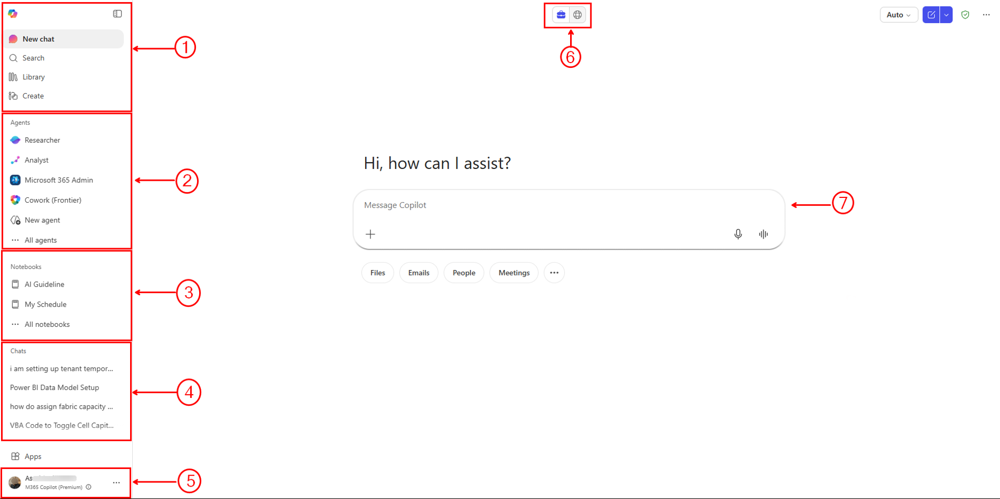

# 01 — Copilot Fundamentals

Before we start using Copilot, it helps to understand what it actually is, what you're paying for, and the key terms you'll keep hearing.

---

## What is Microsoft Copilot?

Microsoft Copilot is an AI assistant built into Microsoft 365. It uses large language models (LLMs) to help you write, summarise, analyse, and automate tasks across apps like Word, Excel, Outlook, PowerPoint, Teams, and more.

Think of it as a smart assistant that understands natural language — you describe what you want, and it does the work.

You access it at: **[m365.cloud.microsoft](https://m365.cloud.microsoft/)**

---

## The Copilot Chat Interface

*The Microsoft 365 Copilot Chat home screen*

| # | Area | What it does |
|---|------|-------------|
| 1 | **Navigation** | New chat, Search, Library (past conversations), Create (agents/notebooks) |
| 2 | **Agents** | Pre-built and custom agents — Copilot instances with a specific role and knowledge base. Includes Researcher, Analyst, M365 Admin, and any agents your organisation has built |
| 3 | **Notebooks** | Persistent context you create for a project or topic. Unlike a regular chat, a Notebook remembers your background instructions across sessions |
| 4 | **Chats** | Your recent conversation history. Each chat is independent — Copilot does not carry memory between chats by default |
| 5 | **Your profile** | Your Microsoft 365 account. Click here to access personal instructions and settings |
| 6 | **Work / Web toggle** | Switch between searching your Microsoft 365 data (Work) and the public internet (Web) |
| 7 | **Message box** | Where you type your prompt. The `+` button lets you attach files, images, or reference M365 content |

---

## Licensing: What Are You Getting?

There are two main tiers you need to know about:

### Microsoft Copilot (Free / Default)
- Available to anyone with a Microsoft account
- Powered by the web version of Copilot at [copilot.microsoft.com](https://copilot.microsoft.com)
- Can use the internet for research
- Does NOT have deep integration with your Microsoft 365 data (emails, files, calendar, etc.)
- Good for general tasks: summarising, writing, brainstorming

### Microsoft 365 Copilot (Paid — per user licence)
- Requires a Microsoft 365 subscription PLUS a Copilot add-on licence
- Deeply integrated with your Microsoft 365 data — it can read your emails, files on SharePoint/OneDrive, Teams messages, and calendar
- Works inside Word, Excel, Outlook, PowerPoint, Teams, Forms, and more
- Can reference your organisation's documents when generating responses
- This is what we are using in this workshop — access it at [m365.cloud.microsoft](https://m365.cloud.microsoft/)

> **Key point:** The free version is useful, but the paid version is where the real productivity gains happen because it knows your work context.

---

## Key AI Terminology

You will hear these terms during the workshop. Here's what they actually mean in plain language.

### Large Language Model (LLM)
A type of AI trained on massive amounts of text. It learns patterns in language and uses them to generate responses. Examples: GPT (from OpenAI), Claude (from Anthropic), Gemini (from Google). Microsoft 365 Copilot is powered by GPT models from OpenAI.

### Generative AI (GenAI)
AI that can create new content — text, images, code, summaries — rather than just analysing existing data. Copilot is a generative AI tool.

### Natural Language Processing (NLP)
The technology that allows AI to understand and process human language. When you type a prompt in plain English and Copilot understands what you mean, that's NLP at work.

### Prompt
The instruction or question you give to Copilot. The quality of your prompt directly affects the quality of the output. We will cover this in detail in the next topic.

### Context
The information you provide alongside your prompt. The more relevant context you give Copilot, the better its responses will be. Example: instead of "write me an email", you give it the recipient, the purpose, the tone, and the key points.

### Hallucination
When an AI confidently generates something that is incorrect or made up. This happens because LLMs predict likely responses based on patterns, not because they "know" facts. Always verify important information from Copilot against reliable sources.

### Agentic AI
AI that can take actions on your behalf, not just respond to questions. Instead of just answering "how do I send a meeting invite?", an agentic AI can actually send the invite for you. Copilot Studio agents (covered in Topic 10) are an example of this.

### Retrieval-Augmented Generation (RAG)
A technique where the AI retrieves relevant information from a specific knowledge source (like your company's SharePoint) before generating a response. This is what makes Microsoft 365 Copilot different from a generic chatbot — it can pull from your actual documents.

### Token
The unit of text that LLMs process. Roughly speaking, 1 token ≈ 0.75 words. Models have a limit on how many tokens they can process at once. For practical purposes: very long documents may need to be broken up, and very long conversations may cause the AI to "forget" earlier context.

---

## Why Does the Same Prompt Give Different Answers?

You will notice that if you send the exact same prompt twice, you rarely get the exact same response. This surprises a lot of people. Here is why.

### Randomness is built in (Temperature)
LLMs do not work like a calculator that always produces the same result. When generating a response, the model has a setting called **temperature** that controls how much randomness is introduced. A higher temperature means more creative and varied output. A lower temperature means more predictable, conservative output. Copilot uses a moderate temperature by default, which is why responses feel natural rather than robotic — but also why they vary.

### The model picks from probabilities, not a fixed answer
When Copilot generates the next word in a response, it is actually choosing from a probability distribution — many possible next words, each with a likelihood score. It does not always pick the single most likely word. This statistical variation means two runs of the same prompt can take different paths and arrive at different outputs.

### Model differences
When you switch between models (Auto, Opus, GPT), you are talking to a completely different AI system with different training, different style tendencies, and different strengths. A prompt asking for a formal summary will produce noticeably different results in Claude Opus versus GPT-4o.

### Practical takeaway
Do not assume Copilot's first response is the only possible response. If you do not like what you get, run the prompt again, or follow up with refinements. Iteration is normal — not a sign that something went wrong.

---

## Memory: What Does Copilot Remember?

Understanding how Copilot handles memory helps you use it more effectively and avoid surprises.

### Within a conversation (short-term memory)
Within a single chat session, Copilot holds the entire conversation in its **context window** — the working memory it can see at any one time. This means:
- You can refer back to earlier parts of the conversation: "use the tone from your first draft"
- Copilot can build on what you discussed earlier without you repeating yourself
- However, very long conversations can push older content out of the context window, causing Copilot to "forget" what was said early on

### Across conversations (long-term memory)
By default, Copilot Chat does **not** remember anything from previous sessions. Each new conversation starts fresh. If you start a new chat, Copilot has no memory of what you discussed yesterday.

Some versions of Copilot are beginning to introduce optional memory features that allow it to retain preferences across sessions, but this depends on your organisation's settings and the version of Copilot your tenant is using.

### Notebooks (Persistent context)
Copilot Chat includes a **Notebooks** feature (item **③** in the interface above) that lets you create a persistent context — a set of instructions or background information that Copilot always has available in that notebook, even across sessions. Think of it as giving Copilot a permanent briefing document for a specific project or topic.

### What this means for you
- If you want Copilot to maintain a particular tone or approach throughout a project, say so at the start of each session, or use Notebooks
- Do not assume Copilot remembers previous conversations — it does not, unless you are in the same session or using a notebook
- If a long conversation feels like Copilot is losing track of earlier context, start a fresh session and re-state the key background information

---

## Custom Personalisation

You can shape how Copilot responds to you — both personally and at an organisational level.

### Personal instructions (Your profile)
In Copilot Chat, click your profile (item **⑤** in the interface above) to access personal instructions. These influence every response and persist across all your sessions. Examples of what you can tell it:
- Your role and industry: "I am an HR manager at a manufacturing company in Malaysia"
- Preferred language style: "Always write in British English, formal tone"
- Default output format: "Summarise responses in bullet points unless I ask otherwise"
- Constraints: "Do not use jargon — my audience is non-technical"

### Agents (Custom Copilots)
In Copilot Chat, you can access pre-built or custom-built agents under the **Agents** panel (item **②** in the interface above). These are Copilot instances that have been given a specific role, a custom knowledge base, and a defined set of behaviours. For example, an HR agent that only answers questions using your company's HR policy documents.

You can also build your own agents in Copilot Studio (covered in Topic 10).

### Tenant-level customisation (IT and admin)
Your IT or Microsoft 365 admin can configure Copilot at the organisation level:
- Restricting which data sources Copilot can access
- Setting up approved agents for the organisation
- Configuring which AI models are available to users
- Applying compliance and data governance rules

This is important context for understanding why your Copilot experience might look different from someone at another company using the same tool.

---

## Summary

| Term | One-line meaning |
|------|-----------------|
| LLM | AI trained on text to understand and generate language |
| GenAI | AI that creates new content |
| NLP | Technology that lets AI understand human language |
| Prompt | Your instruction to the AI |
| Context | Background info you give alongside your prompt |
| Hallucination | When AI generates plausible but incorrect information |
| Agentic AI | AI that takes actions, not just answers questions |
| RAG | AI that retrieves from a specific knowledge source before responding |
| Token | Unit of text processed by an LLM |
| Temperature | The randomness setting that makes AI responses vary |
| Context window | The working memory an LLM can see at one time |
| Notebook | A persistent context you can give Copilot across sessions |

---

*Next: [02 — Prompt Engineering](../02-prompt-engineering/)*
