# 01 - Copilot Fundamentals: Getting Started

By the end of this session you will be able to sign in to Microsoft 365 Copilot, find your way around the interface, run your first prompt, tune your personalization settings, and check Copilot's answers against their sources.

This guide is written for first-time users on either a Basic or a Premium license. Where the two behave differently, look for the **License note** callouts.

**What you need:** a work account with Microsoft 365, a browser, and about 60 minutes.

> **Prompts to Try:** Open the [copy-paste prompt exercises](./prompts.md) for this topic.

---

## 1. Copilot and your license

Microsoft 365 Copilot is Microsoft's AI assistant for work. What you can do with it depends on which license your organization has assigned to you.

| License | How you get it | What it adds |
|---------|----------------|--------------|
| **Basic** | Included with your Microsoft 365 work account | Chat with Copilot, grounded in the web |
| **Premium** | Paid monthly add-on on top of Microsoft 365 | Work IQ (access to your work data), more model choices, agents such as Researcher and Analyst |
| **AI credits / AI Hub** | Pay-as-you-go, billed by tokens | Advanced features such as Cowork and Copilot Studio |

**Why it matters:** two colleagues can open the same Copilot page and see different buttons. If your screen does not match the instructor's, check your license first (next section).

---

## 2. Sign in and check your license

1. Open your browser and go to **[m365.cloud.microsoft](https://m365.cloud.microsoft/)**.
2. Sign in with your work account.
3. Look at the bottom-left corner of the screen. Your name appears with a label underneath, for example *M365 Copilot (Premium)*.


*Your license label appears under your name, bottom-left.*

> **Try it:** read your label aloud. Does it say Premium or Basic? Keep it in mind for the rest of the session.

---

## 3. Tour of the interface

The screen has three zones: the sidebar on the left, the controls along the top, and the message box in the centre.

### Sidebar (left)

| Item | What it does |
|------|-------------|
| **App launcher** | Jump to other Microsoft 365 apps |
| **Sidebar toggle** | Collapse or expand the sidebar |
| **Chat / Cowork** | Switch between chatting and Cowork (Cowork needs AI credits) |
| **New chat** | Start a fresh conversation |
| **Search** | Find past chats |
| **Library** | Files and content you have created with Copilot |
| **Agents** | Specialised assistants, such as Researcher and Analyst |
| **Notebooks** | Group related chats and files together |
| **Pinned** | Agents you have pinned for quick access, such as Researcher and Analyst |
| **Chats** | Your chat history |

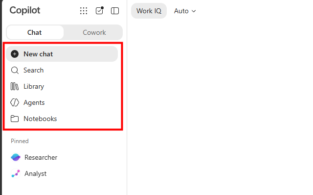

*The sidebar navigation.*

**Chat history shapes your answers.** Copilot takes your previous chats into account. If you are new, its answers may feel more generic, and the same prompt can give you and a colleague different results.

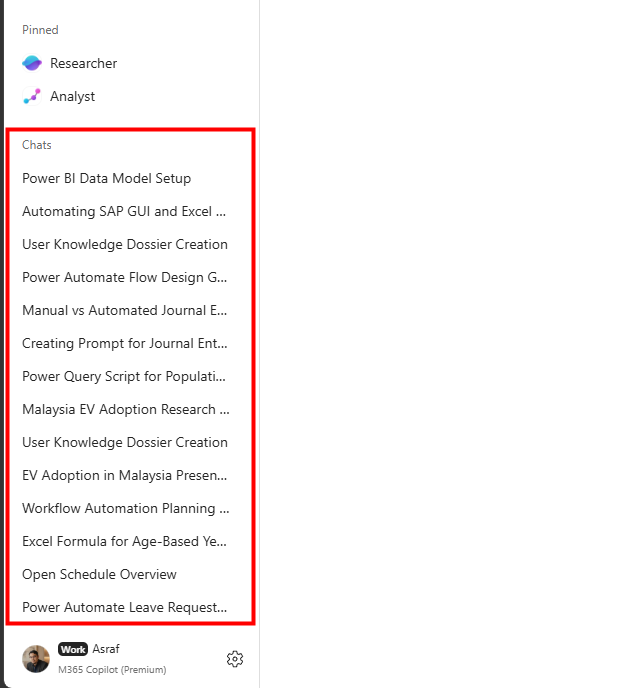

*Your previous chats, listed under Chats.*

### Top bar

| Control | What it does |
|---------|-------------|
| **Work IQ** | Lets Copilot use your work data through Microsoft Graph: OneDrive, SharePoint, email, and more. A line through it means it is switched off |
| **Auto (model selector)** | Choose how Copilot thinks: Auto, Quick response, Think deeper, or Advanced reasoning. You can also pick a model family such as GPT or Claude |
| **Shield icon** | Enterprise Data Protection (EDP) is on |
| **Temporary chat** | Chat without saving the conversation to your history |

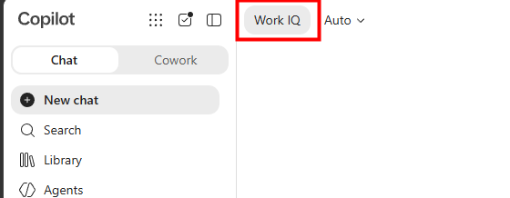

*Work IQ, top-left of the chat area (Premium only).*

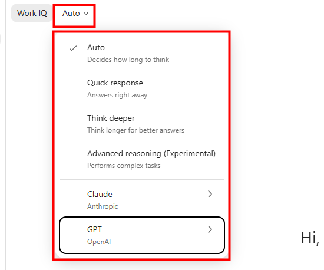

*The model selector, opened from the Auto button.*

> **License note:** Work IQ appears only on Premium. Basic users may see GPT models only, while Premium users may also see Claude. Your organization's settings can change what appears.

### Enterprise Data Protection: what it does and does not mean

**It does** keep your prompts and files from being used to train the underlying AI models.

**It does not** make your chats private from your organization. IT can still review chat history and searches using built-in compliance tools.


*The green shield confirms Enterprise Data Protection. Temporary chat sits right next to it.*

Treat Copilot like your work email: secure, but not personal.

---

## 4. Your first prompt

A prompt is the instruction you type into the message box. Start with a simple one.

1. Click inside **Message Copilot**.
2. Type: `EV adoption in Malaysia`
3. Press **Enter** or click the arrow to send.

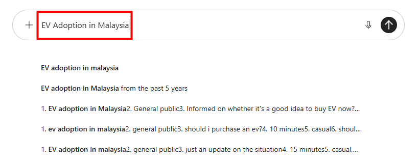

*Your first prompt in the message box.*

Copilot replies with a structured overview: headings, a summary table, and source labels.

### Why your answer differs from your neighbour's

| Reason | What it means |
|--------|--------------|
| **Temperature** | AI models add a little randomness, so wording and detail vary each time |
| **Chat history** | Copilot draws on your past conversations |
| **Personalization** | Your custom instructions, memories, and work profile shape the reply |
| **Work IQ** | Premium users may get answers that include their own files |

Different is normal. What matters is whether the answer is accurate, and section 6 shows how to check.

---

## 5. Personalize Copilot

Personalization controls how Copilot tailors its answers to you.

### Open Settings (two ways)

- Click the **gear icon** at the bottom-left, then **Settings**.
- Or click the **ellipsis (…)** at the top-right, then **Settings**.

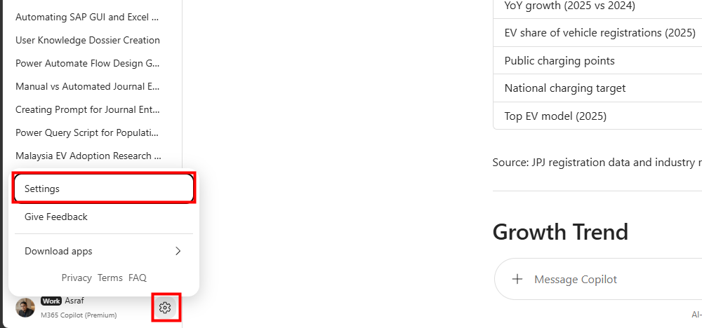

*Opening Settings from the gear icon.*

Then choose **Personalisation** (the menu uses British spelling).

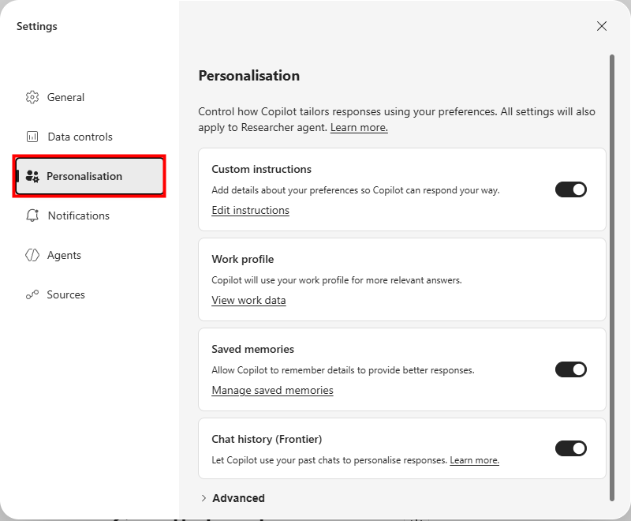

*The Personalisation panel.*

### The four options

| Setting | What it does | When to use it |
|---------|-------------|----------------|
| **Custom instructions** | Tell Copilot how you want it to respond: tone, format, your role | Set once; saves you repeating yourself in every prompt |
| **Work profile** | Uses your organization's profile data to make answers relevant to your job | Set up by your organization |
| **Saved memories** | Remembers facts you ask it to remember | Say "remember that…"; review under **Manage saved memories** |
| **Chat history (Frontier)** | Lets Copilot use past chats to personalize replies. Frontier means it is a preview feature | Turn off if you want each chat to start fresh |

> **Try it:** click **Edit instructions** and write two or three lines about your role and how you like answers formatted. Run your EV prompt again and compare. For a fuller template, see [Exercise 6 in the prompts](./prompts.md#exercise-6---write-your-personalisation-prompt).

---

## 6. Check the sources

AI can **hallucinate**: state something confidently that is wrong or made up. Copilot reduces this through **grounding**: it ties its claims to real sources and shows you where each one came from.

### How to check a fact

1. Find the small grey source label at the end of a sentence (for example, *soyacincau +1*).
2. Hover over it to see every source behind that claim.
3. Click a source to open it and confirm the number or statement yourself.

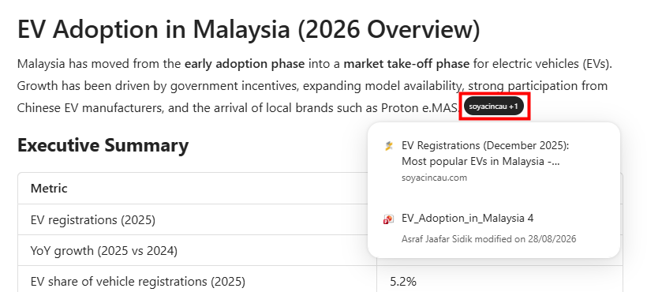

*Hovering a source label reveals both a website and an internal SharePoint file.*

Sources can be public websites or, on Premium with Work IQ on, your own SharePoint and OneDrive files. In the EV example, one figure came from a news site and from a PowerPoint deck in SharePoint.

> **Good habit:** before you put a Copilot number in a report or email, open at least one of its sources. Copilot is a strong first draft, not the final word.

---

## 7. Manage your chats

Hover over any chat in the sidebar and click the three dots (**…**).

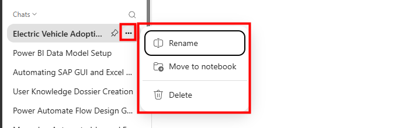

*The chat menu.*

| Action | What it does |
|--------|-------------|
| **Rename** | Give the chat a clearer name so you can find it later |
| **Move to notebook** | File it with related chats and files |
| **Delete** | Remove the chat; Copilot will no longer draw on it for new chats |

> **Tip:** delete chats that went in the wrong direction. Since Copilot learns from your history, a tidy history gives better answers.

---

## 8. Write better prompts with GCSE

A prompt is just an instruction, and a bare one gives you a generic answer. There are many prompting frameworks (zero-shot, few-shot, chain of thought, CRAFT), but the one Microsoft recommends for Copilot is **GCSE: Goal, Context, Scope, Expectation**. Spelling out all four turns a vague request into a precise brief. Topic 02 goes deeper; this is the short version.

| Part | What it covers |
|------|---------------|
| **Goal** | The one thing you want produced, in a sentence. *Create an AI usage guideline manual for our workplace.* |
| **Context** | The background and the why: the situation, the audience, what is at stake |
| **Scope** | How wide to cast the work: the specific topics, angles, comparisons, and outputs to include (statistics, charts, SWOT, recommendations) |
| **Expectation** | The shape of the answer: structure, tone, length, and format, for example a Point, Evidence, Explanation, Implication structure with an executive summary |

> **Try it:** run the bare prompt first, `Create a report on EV adoption in Malaysia`, then run the full GCSE version and compare. The difference in quality is the whole point of the framework.

### Worked example: a GCSE prompt

```
Goal: Create an AI usage guideline manual for our workplace.

Context: Our organisation is introducing Microsoft 365 Copilot
across departments and needs a clear, practical policy so staff
use AI responsibly. Employees have mixed levels of AI experience,
and leadership wants to protect confidential data while
encouraging adoption.

Scope: Cover acceptable and unacceptable uses, data privacy and
confidentiality, human review of AI output, the responsible-AI
principles the organisation commits to, roles and
responsibilities, and practical do's and don'ts for everyday
tasks. Include examples relevant to our work and a short FAQ.

Expectation: Produce a clear, professional manual written for
non-technical staff, organised with headings and short sections,
in plain language, with a one-page summary at the front that
people can read in two minutes.
```

This is the prompt the rest of the guide builds on: you will run it across different models, save it, and ground it in your own files in the sections that follow.

---

## 9. Compare models with one prompt

The same prompt can give quite different answers depending on which model answers it. In this lab you run one simple prompt several times, switching models each time, and compare what comes back.

### The lab

1. Check that the model selector in the top bar shows **Auto**.
2. Type the prompt below and send it: `Create an AI usage guideline manual for our workplace`
3. Open the model selector, switch to **Think deeper**, and run the same prompt again.
4. Repeat with **Claude Opus**, then with **GPT**.
5. Put the answers side by side and compare them using the table below.

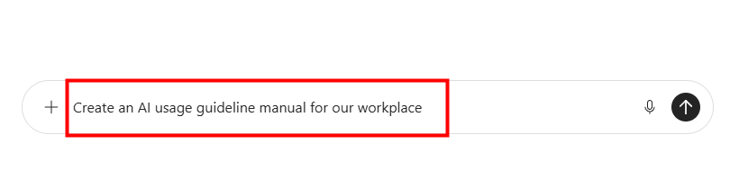

*The lab prompt typed into the message box, with Auto selected.*

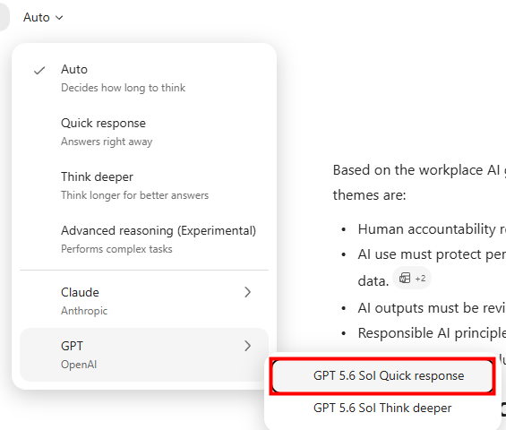

*Switching models: the selector with the GPT options expanded.*

> **Tip:** start a new chat for each run, so the earlier answer doesn't influence the next one.

### What to compare

| Look at | Questions to ask |
|---------|-----------------|
| **Structure** | Does it read like a usable manual, with clear sections and headings? |
| **Depth** | Does it go beyond generic advice? Reasoning modes take longer but usually go deeper |
| **Sources** | Did it cite web pages, or files from your own organisation? |
| **Speed** | How long did you wait, and was the extra wait worth it? |

> **License note:** Claude Opus is available on the Premium license only. Basic users can still run this lab by switching between GPT 5.6 Sol Quick response and Think deeper.

**Why it matters:** there is no single best model. Choosing the right model for the job is a skill, and this lab is the fastest way to build it.

---

## 10. Save and reuse prompts

A prompt that works well is worth keeping. Copilot lets you save prompts and find them again in **Prompt Lab**.

### Save a prompt

1. Hover over a prompt you sent.
2. Click **Save prompt** (the bookmark icon).
3. In the **Save this prompt?** dialog, give it a clear title, for example *AI Guideline*, and save.

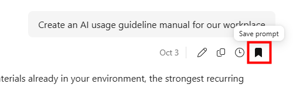

*The Save prompt (bookmark) icon appears when you hover over a prompt.*

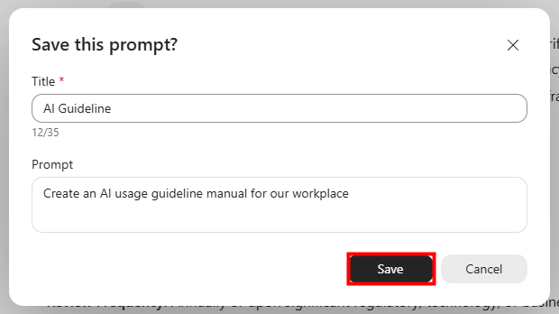

*The Save this prompt? dialog. The title is editable; the prompt text is not.*

You can change the title, but not the prompt text itself. If the prompt needs improving, edit and resend it first, then save the better version.

### Find it again in Prompt Lab

1. Start a new chat.
2. Click the ellipsis (**…**) under the message box and choose **Prompt Lab**.
3. Open **Your saved prompts**.

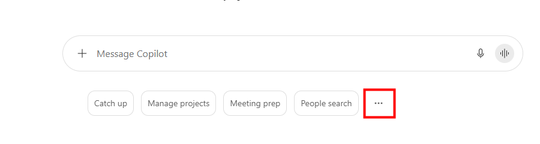

*The ellipsis (…) under the message box opens Prompt Lab.*

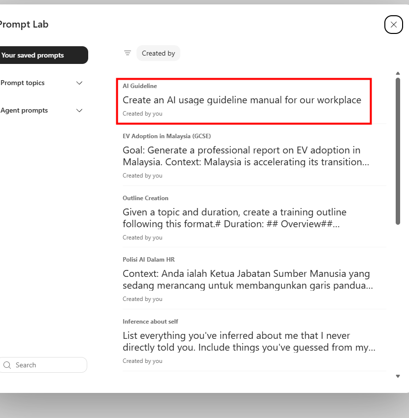

*Prompt Lab, with the saved AI Guideline prompt at the top of Your saved prompts.*

| Action | What it does |
|--------|-------------|
| **Try with Copilot** | Runs the saved prompt in a chat |
| **Copy link** | Copies a link to the prompt |
| **Share** | Shares the prompt with colleagues |
| **Delete** | Removes the prompt from your list |

---

## 11. From chat to a Page: collaborate on the answer

So far you have worked with Copilot like a chat, the same back-and-forth you'd have in Teams, WhatsApp, or Telegram. That works, but it has a weakness. Each time you ask Copilot to adjust an answer, it regenerates the whole thing, and small details drift between versions.

Picture it. You ask for the AI guideline manual and Copilot gives you three topics. You like them, so you ask it to add a title. It returns the title, topic one, and topic two, and topic three has quietly vanished. You point that out, Copilot agrees and puts it back, but now something else has changed. This back-and-forth is tedious, and the output is inconsistent.

For work you want to shape and keep, move the answer out of chat and into a **Page**. A Page is a shared canvas, powered by Microsoft Loop, where you and Copilot edit the same document together instead of regenerating it each turn. Topic 04 covers Pages in depth.

### The response toolbar

Under every Copilot response is a row of actions:

| Action | What it does |
|--------|-------------|
| **Copy** | Copies the response text |
| **Thumbs up** | Tells Copilot you want more answers like this |
| **Thumbs down** | Tells Copilot you want fewer answers like this |
| **Ellipsis (…)** | Opens more options (below) |
| **Sources** | Lists the files and web pages behind the response |


*The toolbar under every response: copy, thumbs up, thumbs down, the ellipsis (…), and Sources.*

### The ellipsis menu

Clicking the ellipsis (**…**) opens more options: **Share response**, **Edit in Pages**, **Export to** (for example to Word), **Read aloud**, and **Schedule this prompt**.

Two things to know. Where you see **Frontier**, that feature is in preview. And some of these options are Premium only.

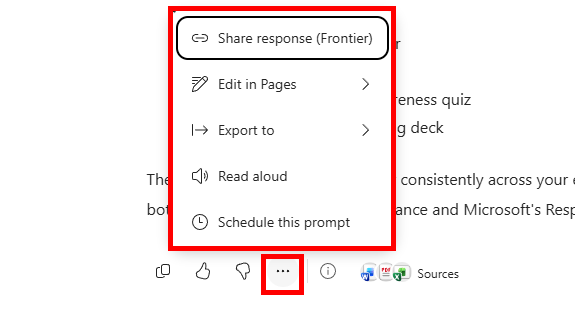

*The ellipsis menu: Share response (Frontier), Edit in Pages, Export to, Read aloud, and Schedule this prompt.*

### Open the answer as a Page

1. Click the ellipsis (**…**) under the response.
2. Choose **Edit in Pages**.
3. Choose **Add to new page** (or **Add to recent page** to append to one you already have).


*Edit in Pages, then Add to new page, opens the response as a Page you can edit with Copilot.*

**Why it matters:** a Page lets you collaborate with Copilot on one living document, so the parts you've settled stay put while you refine the rest. It is especially valuable on a Basic license, where you can't collaborate with Copilot inside Microsoft Word. The Page gives Basic users that shared workspace.

---

## 12. Ground Copilot in your work data (Work IQ)

In section 6 you saw that grounding ties Copilot's answer to real sources. The **Work IQ** button in the top bar decides where Copilot looks for those sources.

| Work IQ | What Copilot searches |
|---------|----------------------|
| **On** | Your work environment through Microsoft Graph: OneDrive, SharePoint, Teams chats, and Outlook, plus the web |
| **Off** (shown struck through) | The web and the model's general knowledge only |


*Work IQ on (top) and off, shown struck through (bottom).*

> **Try it:** run the AI guideline prompt from section 8 with Work IQ on, then again with it off. With Work IQ on, the answer may draw on policy documents already in your organisation and cite them. With it off, you get a generic answer grounded on the web.

> **License note:** Work IQ is a Premium feature. Basic users ground Copilot manually by adding files, covered in the next section.

---

## 13. Add your own files (the plus menu)

The plus (**+**) button to the left of the message box lets you choose what Copilot works from.

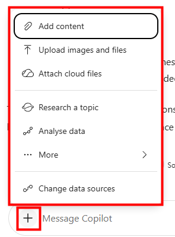

*The plus (+) menu and its options.*

| Option | Use it for |
|--------|-----------|
| **Add content** | Adding content such as a file already in your cloud storage |
| **Upload images and files** | Files on your local computer only |
| **Attach cloud files** | Files already in OneDrive or SharePoint |
| **Research a topic** | Starting a focused research task |
| **Analyse data** | Starting a data-analysis task |
| **More** | Further options |
| **Change data sources** | Choosing where Copilot draws its data from |

### Upload a file from your computer

1. Click **+** and choose **Upload images and files**.
2. Select the file, for example the sample AI guideline, and click **Open**.
3. A banner confirms that uploading from your device sends a copy to OneDrive.
4. Ask your question about the file.

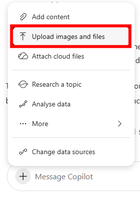

*Choose Upload images and files for a file on your computer.*

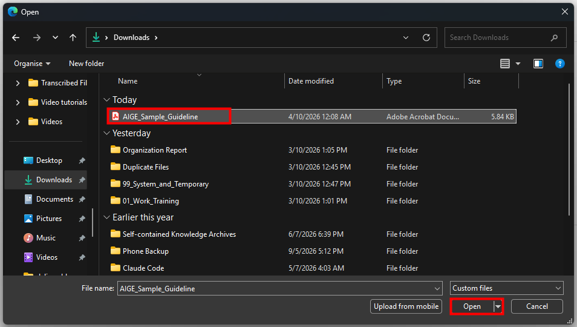

*Selecting the sample guideline in the Open dialog.*

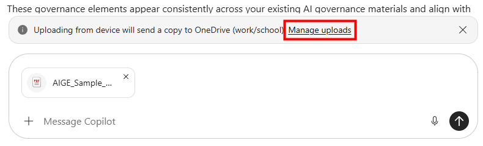

*The banner confirms a copy goes to OneDrive. Manage uploads opens the folder.*

### Where your uploads go

Every upload saves a copy to a OneDrive folder called **Microsoft Copilot Chat Files**. The **Manage uploads** link in the banner opens it.

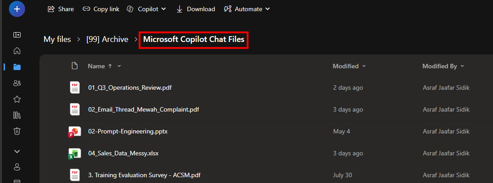

*Uploaded files collect in the Microsoft Copilot Chat Files folder in OneDrive.*

> **Good habit:** check that folder before you upload. If the file is already there, use **Attach cloud files** instead of uploading again, so you don't fill your OneDrive with duplicate copies of large files.

> **License note:** this is the main way Basic users ground Copilot in their own documents. Basic cannot pull files from SharePoint or OneDrive automatically, so download the file and upload it. Premium users can also let Work IQ find files for them.

> **Try it:** upload a sample guideline (the screenshots use *AIGE_Sample_Guideline.pdf*; you can also use [Data_Privacy_AI_Acceptable_Use_Policy.pdf](../03-copilot-chat/Data_Privacy_AI_Acceptable_Use_Policy.pdf) from Topic 03) and ask: `Summarise the key principles in this guideline and list what end users must do.`

---

## 14. Find resources with the slash (/) command

Type **/** in the message box to open a resource picker. Tabs across the top filter by type: All, People, Files, Meetings, Emails, Chats, Channels, Sites, and Power BI, with more under **+1**. Type a keyword to narrow the list, then click a resource to add it to your prompt.

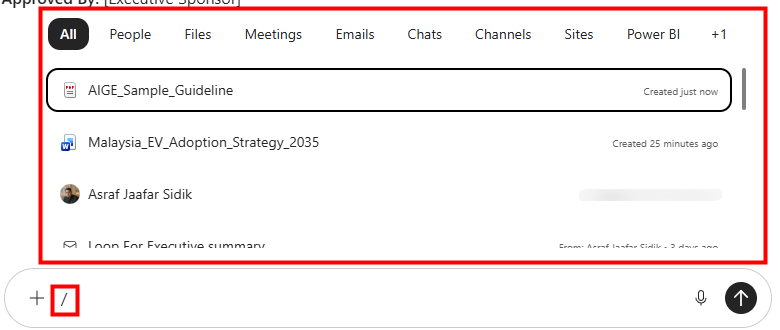

*Typing / opens the resource picker, with the uploaded guideline at the top.*

> **Try it:** type `/` followed by the name of the guideline you uploaded, select it, and ask a question about it.

> **License note:** the Emails, Meetings, Chats, Channels, and Sites tabs are Work IQ sources, so the full picker is effectively a Premium experience. Basic users see a much thinner version, mostly limited to files they have uploaded or opened.

---

## Key AI terms

You will hear these terms throughout the workshop.

| Term | One-line meaning |
|------|-----------------|
| LLM | AI trained on text to understand and generate language (GPT, Claude, Gemini) |
| GenAI | AI that creates new content: text, images, code, summaries |
| Prompt | Your instruction to the AI |
| Context | Background info you give alongside your prompt |
| Grounding | Tying the AI's answer to real sources you can check |
| Hallucination | When AI generates plausible but incorrect information |
| Temperature | The randomness setting that makes AI responses vary |
| Token | The unit of text an LLM processes; roughly 0.75 words |
| Context window | The working memory an LLM can see at one time |
| RAG | Retrieving from a specific knowledge source before responding; what Work IQ does with your files |
| Agentic AI | AI that takes actions, not just answers questions |
| Notebook | A place to group related chats and files for a project |

---

*Next: [02 - Prompt Engineering](../02-prompt-engineering/)*
