# 03 — Copilot Chat

Copilot Chat is your starting point for research, brainstorming, and exploration. This is where you will begin the workshop's main project: building an AI Usage Guide for your department.

> **Prompts to try:** See [prompts.md](./prompts.md) for research prompts, model comparison exercises, and a consolidation prompt to wrap up your notes.

---

## What is Copilot Chat?

Copilot Chat is the conversational interface in Microsoft 365 Copilot. You access it at [m365.cloud.microsoft](https://m365.cloud.microsoft/) or through the Copilot icon in Microsoft 365 apps. It can:

- Search the web for current information
- Reference your Microsoft 365 files, emails, and calendar (with an M365 Copilot licence)
- Use different AI models including GPT and Claude Opus
- Generate text, summarise documents, and help you think through problems

---

## The Message Box — What Every Button Does

Before you start prompting, it helps to know what each control around the message box does.

### The + button (Add content)

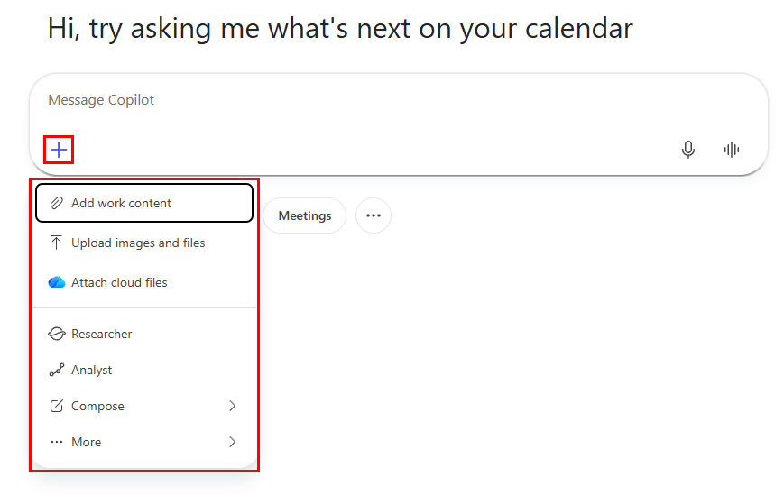

*Click + to attach content or switch to a specialist agent*

| Option | What it does |
|--------|-------------|
| **Add work content** | Search and reference your M365 files, emails, meetings, or people directly in your prompt |
| **Upload images and files** | Attach a local file (PDF, Word, image) for Copilot to read and reference |
| **Attach cloud files** | Link a file from OneDrive or SharePoint |
| **Researcher / Analyst / Compose** | Switch to a specialist agent with a specific focus area |

### Grounding — Work vs Web

*The grounding toggle controls where Copilot searches*

| Mode | What it searches |
|------|----------------|
| **Work (briefcase icon)** | Your Microsoft 365 data — emails, files, calendar, Teams messages |
| **Web (globe icon)** | The public internet via Bing |

For the research phase of this workshop, use **Web** mode to gather information about AI guidelines and best practices. Switch to **Work** mode when you want Copilot to reference your actual company documents.

### Quick filters — Files, Emails, People, Meetings

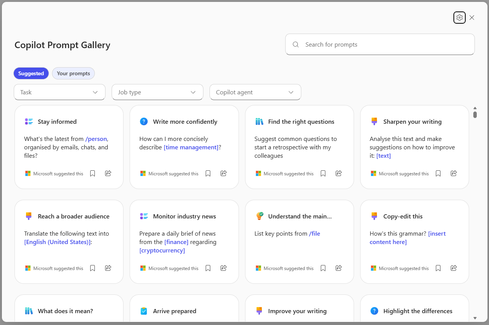

*Shortcut buttons to search specific M365 data types*

These buttons below the message box let you quickly scope your question to a specific data type without writing a full prompt. Click **Files** to find a document, **Emails** to search your inbox, **People** to look up a colleague, or **Meetings** to reference a recent meeting.

### Voice input

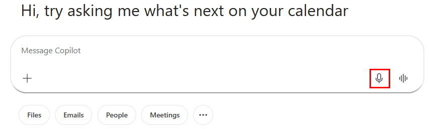

*Microphone button — speak your prompt instead of typing*

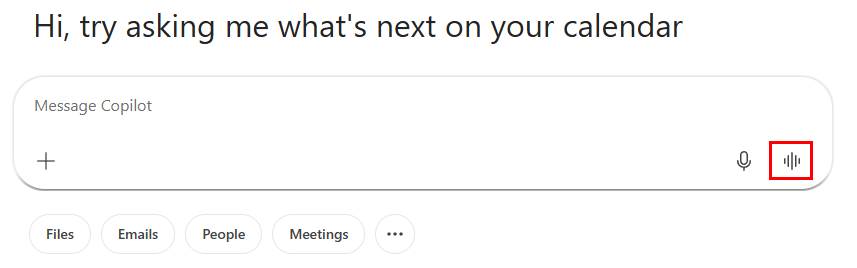

*Sound wave button — have a full voice conversation with Copilot*

The **microphone** transcribes your speech into text in the message box. The **sound wave** icon starts a live voice conversation where Copilot responds out loud — useful for hands-free brainstorming.

---

## Prompt Controls and Output Controls

After you submit a prompt and receive a response, two sets of controls appear.

### Prompt controls (on your message)

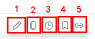

*Controls on your submitted prompt: edit, copy, history, save, share*

| # | Button | What it does |
|---|--------|-------------|
| 1 | **Edit** | Edit your prompt and resubmit without retyping |
| 2 | **Copy** | Copy your prompt text |
| 3 | **History** | View previous versions of this prompt |
| 4 | **Save** | Save the prompt to your Prompt Gallery |
| 5 | **Share** | Share the prompt with a colleague |

### Output controls (on Copilot's response)

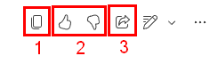

*Controls on Copilot's response: copy, thumbs up, thumbs down, share*

| # | Button | What it does |
|---|--------|-------------|
| 1 | **Copy** | Copy the full response to clipboard |
| 2 | **Thumbs up** | Mark the response as helpful (improves suggestions) |
| 3 | **Thumbs down** | Flag the response as unhelpful |

### Edit in Pages

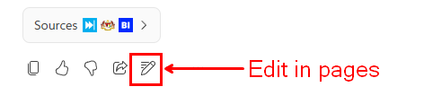

*The pencil icon sends the response directly to a new Copilot Page*

The **Edit in Pages** button (pencil icon, far right of the output controls) opens the response as an editable Copilot Page — a live collaborative document you can continue working on. This is how you move from research in Copilot Chat into the drafting phase in Topic 04.

---

## Other Features Worth Knowing

### Temporary chat

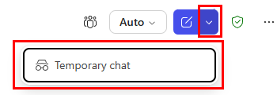

*Temporary chat — this conversation will not be saved to your history*

Click the dropdown arrow next to the new chat icon and select **Temporary chat** to start a session that is not saved to your chat history. Useful when you want to experiment or discuss something sensitive without it appearing in your recent chats.

### Privacy and compliance indicator

*The shield icon confirms this chat is covered by your organisation's compliance policies*

The shield icon in the top bar indicates that your conversation is protected under your organisation's Microsoft 365 compliance and data governance policies — it is not used to train Microsoft's AI models.

### Recent pages

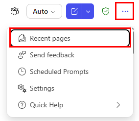

*Access your recent Copilot Pages and settings from the ... menu*

The **...** menu (top right) gives you access to Recent pages, Settings, Scheduled Prompts, and Quick Help.

### Create — export a response as a document

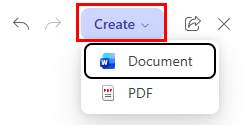

*Export the current conversation or response as a Word document or PDF*

The **Create** button (top right, visible when a response is open) lets you export content directly as a Word document or PDF — useful when you want to take your research notes out of Copilot Chat.

---

## The Prompt Gallery

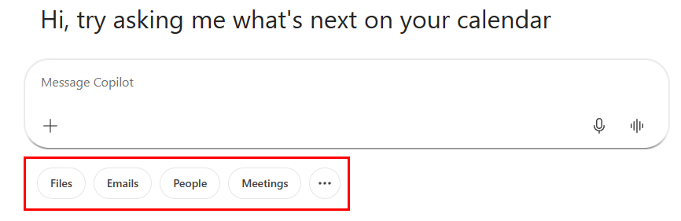

*The Copilot Prompt Gallery — browse, search, and save prompts by task and job type*

The Prompt Gallery is a built-in library of Microsoft-suggested prompts, organised by task and job type. You can also save your own prompts here using the bookmark icon on any prompt you submit. Access it via the **+** button or by clicking the book icon in the left sidebar.

---

## Switching Models in Copilot Chat

Click the **Auto** button at the top right to switch between AI models.

| Model | Best for |
|-------|---------|
| **Auto** | General use — Copilot decides the best approach based on your prompt |
| **Quick Response** | Fast, concise answers when you do not need deep analysis |
| **Think Deeper** | Complex reasoning, longer analysis, nuanced tasks |
| **Opus (Claude)** | Writing, analysis, and nuanced reasoning — by Anthropic |
| **GPT** | General tasks — by Open AI. Expand to choose specific versions (GPT 5.5, 5.4, 5.2) |

> **Workshop exercise:** Try the same research prompt in both Opus and GPT. Compare tone, depth, and structure. Which output would you use as a starting point for your AI Usage Guide?

---

## Workshop Scenario: Research Phase

Your task is to research and draft an **AI Usage Guide for your department**. This guide will help your team understand how to use AI tools responsibly and effectively at work.

Use **Web** grounding mode for this phase so Copilot can pull current information from the internet. Switch to **Work** mode later when you want to reference your own company documents.

See [prompts.md](./prompts.md) for the full set of research prompts to use in this phase.

---

## Copilot Pages — The Link to Topic 04

Once you have useful research in Copilot Chat, you have two ways to move it into a document:

**Option 1 — Edit in Pages:** Click the pencil icon on any response to open it as a live Copilot Page for collaborative editing.

**Option 2 — Create:** Use the Create button to export the conversation as a Word document or PDF.

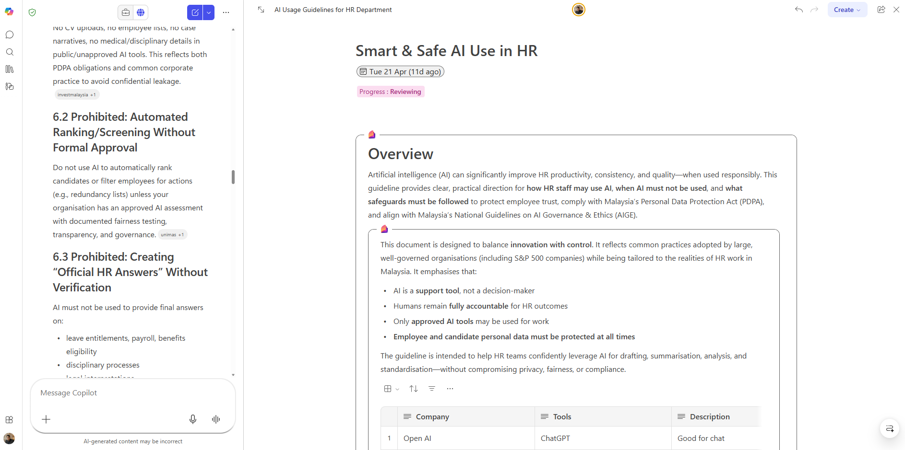

*A Copilot Page in action — the chat continues on the left, the editable document on the right*

Topic 04 covers Copilot Pages in detail. The research you build here is the raw material you will shape into your AI Usage Guide draft there.

---

## Tips for Research in Copilot Chat

- Start broad, then narrow. Get a high-level overview first, then use follow-up prompts to go deeper on specific sections.
- Stay in the same conversation rather than starting new chats — Copilot builds on earlier context and your research stays connected.
- If Copilot cites sources in Web mode, check them. Live search results are usually accurate but not always — verify anything you plan to include in your guide.
- Save prompts that work well using the bookmark icon so you can reuse them in future sessions.
- Use the **Edit** button on your prompts to refine and resubmit without retyping from scratch.
- When you have enough research, use the consolidation prompt in [prompts.md](./prompts.md) to turn your notes into a structured outline before moving to Pages.

---

*Back to: [02 — Prompt Engineering](../02-prompt-engineering/) | Next: [04 — Copilot Pages](../04-copilot-pages/)*
