# 03 — Copilot Chat

Copilot Chat is your starting point for research, brainstorming, and exploration. This is where you will begin the workshop's main project: building an AI Usage Guide for your department.

> **Prompts to Try:** Open the [copy-paste prompt exercises](./prompts.md) for this topic.

---

## What is Copilot Chat?

Copilot Chat is the conversational interface in Microsoft 365 Copilot. You access it at [m365.cloud.microsoft](https://m365.cloud.microsoft/) or through the Copilot icon in Microsoft 365 apps. It can:

- Search the web for current information
- Reference your Microsoft 365 files, emails, and calendar (with an M365 Copilot licence)
- Use different AI models including GPT and Claude Opus
- Generate text, summarise documents, and help you think through problems

---

## The Message Box — What Every Button Does

Before you start prompting, it helps to know what each control around the message box does.

### The + button (Add content)

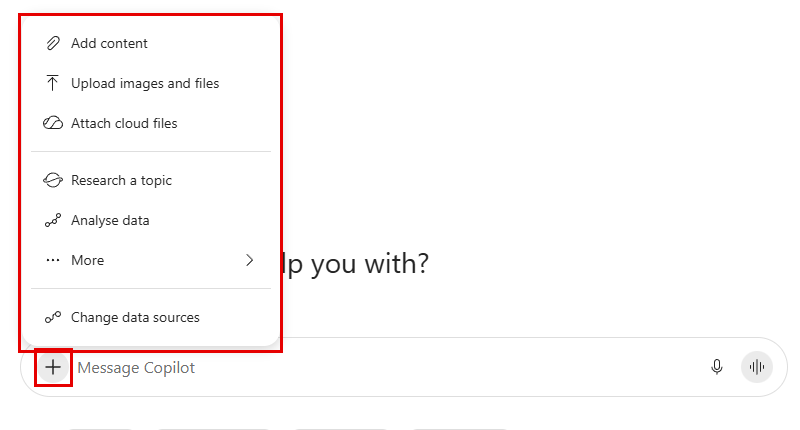

*Click + to attach content or switch to a specialist agent*

| Option | What it does |
|--------|-------------|
| **Add content** | Search and reference your M365 files, emails, meetings, or people directly in your prompt |
| **Upload images and files** | Attach a local file (PDF, Word, image) for Copilot to read and reference |
| **Attach cloud files** | Link a file from OneDrive or SharePoint |
| **Research a topic / Analyse data** | Hand the task to the Researcher or Analyst agent for deeper, specialist work |
| **More** | Further tools and agents available in your tenant |
| **Change data sources** | Choose which sources Copilot can use to ground its answer |

### Grounding — Work IQ on vs off

*The Work IQ toggle (top left) controls where Copilot searches. When it is off, the label is struck through*

**Grounding** is the process of connecting an AI's response to a specific, trusted source of information rather than relying on its general training data alone. When Copilot is grounded, it retrieves real content from a defined source before generating a response — this is what makes its answers relevant to your actual work context rather than generic.

| Mode | What it searches |
|------|----------------|
| **Work IQ on** | Your Microsoft 365 data — emails, files, calendar, Teams messages, SharePoint — as well as the web |
| **Work IQ off** | The public internet only, via Bing |

**When to keep Work IQ on (Work mode):**
- Finding information from your own company files or emails
- Summarising a document stored in SharePoint or OneDrive
- Asking about a meeting, a colleague, or a recent project
- Drafting content that references your organisation's actual context

**When to turn Work IQ off (Web mode):**
- Researching external topics, industry best practices, or current events
- Looking up regulations, guidelines, or public information
- Comparing your approach against what other organisations do
- Any task where you need information beyond what your company has

For the research phase of this workshop, turn **Work IQ off** (Web mode) to gather information about AI guidelines and best practices. Turn it back **on** (Work mode) when you want Copilot to reference your actual company documents.

> **Important:** When in Work mode, Copilot only accesses data you already have permission to see. It respects your Microsoft 365 permissions — it cannot read files or emails that you do not have access to.

---

### Microsoft Graph — How Work Mode Knows Your Data

When Work IQ is on (Work mode), Copilot does not search your files the way Google searches the web. Instead, it uses **Microsoft Graph** — a unified API layer that sits across all your Microsoft 365 services.

Think of Microsoft Graph as a single connection point that links everything in your Microsoft 365 environment: your emails in Outlook, files in OneDrive and SharePoint, calendar events, Teams chats, contacts, and meeting transcripts. Rather than searching each service separately, Copilot queries Microsoft Graph once and gets a consolidated view of your work data.

**What this means in practice:**
- When you ask "what did we discuss in last Tuesday's meeting?", Copilot queries Graph for your calendar and any associated Teams meeting transcript
- When you ask "find the Q1 report", Copilot queries Graph for files across OneDrive and SharePoint that you have access to
- When you ask "what emails have I received from the finance team this week?", Copilot queries Graph for your Outlook data

**Why it matters for your AI Usage Guide:**
Your AI Usage Guide should acknowledge that Copilot in Work mode can see a broad range of company data — and staff should understand this so they are thoughtful about what they discuss and store in Microsoft 365. It is not a risk to be alarmed about, but it is context worth including in any responsible AI guideline.

### Suggestion chips and the Prompt Lab

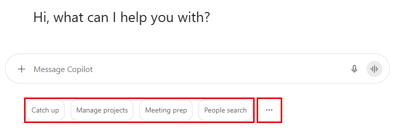

*Suggestion chips below the message box. The ... button opens the Prompt Lab*

The chips below the message box give you ready-made starting points. With Work IQ on you will see work tasks such as **Catch up**, **Manage projects**, **Meeting prep**, and **People search**; with Work IQ off they switch to general tasks such as **Learn**, **Find**, **Summarise**, and **Suggest**. Click **...** to open the full Prompt Lab.

### Voice input

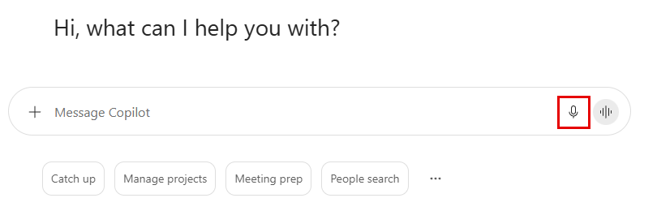

*Microphone button — speak your prompt instead of typing*

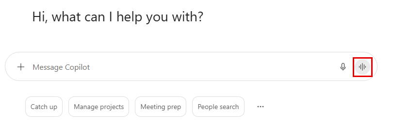

*Sound wave button — have a full voice conversation with Copilot*

The **microphone** transcribes your speech into text in the message box. The **sound wave** icon starts a live voice conversation where Copilot responds out loud — useful for hands-free brainstorming.

---

## Prompt Controls and Output Controls

After you submit a prompt and receive a response, two sets of controls appear.

### Prompt controls (on your message)

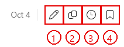

*Hover over your submitted prompt to see: edit, copy, schedule, and save*

| # | Button | What it does |
|---|--------|-------------|
| 1 | **Edit** | Edit your prompt and resubmit without retyping |
| 2 | **Copy** | Copy your prompt text |
| 3 | **Schedule this prompt** | Run the prompt automatically on a schedule (for example, every Monday morning) |
| 4 | **Save prompt** | Save the prompt to *Your saved prompts* in the Prompt Lab |

### Output controls (on Copilot's response)

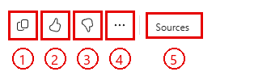

*Controls on Copilot's response: copy, thumbs up, thumbs down, more options, and sources*

| # | Button | What it does |
|---|--------|-------------|
| 1 | **Copy** | Copy the full response to clipboard |
| 2 | **Thumbs up** | Mark the response as helpful (improves suggestions) |
| 3 | **Thumbs down** | Flag a response that missed the mark and say why |
| 4 | **More options (...)** | Share response, Edit in Pages, Export to Word, Read aloud, and Schedule this prompt |
| 5 | **Sources** | See the web pages or work files Copilot used to ground the answer |

### Edit in Pages

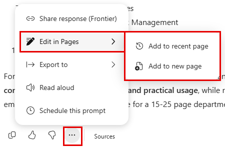

*More options (...) → Edit in Pages → Add to new page (or Add to recent page)*

**Edit in Pages** (in the **...** menu under a response) opens the response as an editable Copilot Page — a live collaborative document you can continue working on. Choose **Add to new page** to start a fresh page, or **Add to recent page** to append to one you already have. This is how you move from research in Copilot Chat into the drafting phase in Topic 04.

---

## Other Features Worth Knowing

### Temporary chat

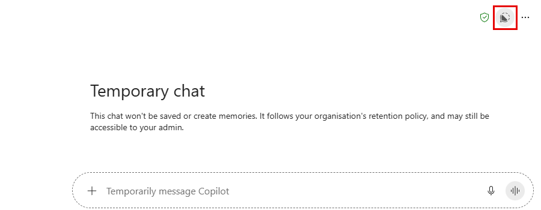

*Temporary chat — this conversation will not be saved to your history*

Click the **Temporary chat** icon (speech bubble, top right) to start a session that is not saved to your chat history and does not create memories. Useful when you want to experiment without it appearing in your recent chats. It still follows your organisation's retention policy.

### Privacy and compliance indicator

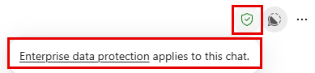

*Hover over the green shield to see "Enterprise data protection applies to this chat"*

The green shield icon in the top bar indicates that your conversation is protected under your organisation's Microsoft 365 compliance and data governance policies — it is not used to train Microsoft's AI models.

### Recent pages

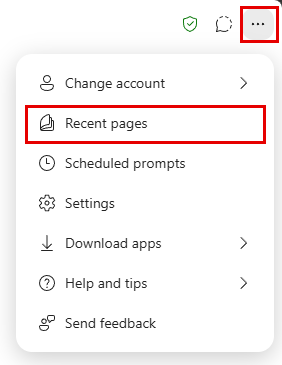

*Access your recent Copilot Pages from the ... menu (top right)*

The **...** menu (top right) gives you access to Recent pages, Scheduled prompts, Settings, Download apps, Help and tips, and Send feedback.

### Export to — save a response as a Word document

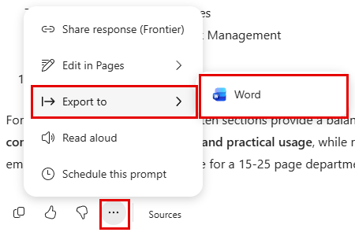

*More options (...) → Export to → Word*

**Export to** (in the **...** menu under a response) saves the response directly as a Word document — useful when you want to take your research notes out of Copilot Chat.

---

## The Prompt Lab

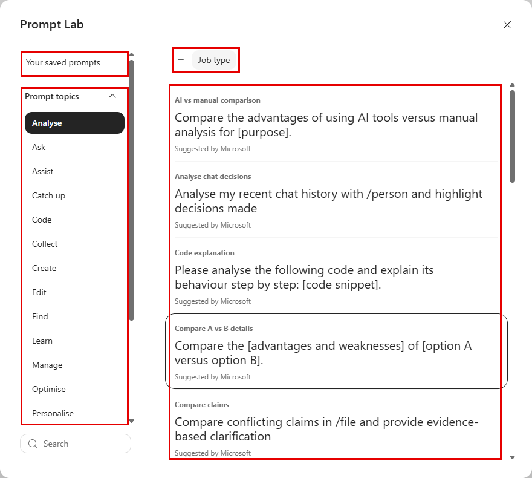

*The Copilot Prompt Lab — your saved prompts, prompt topics, a Job type filter, and Microsoft-suggested prompts*

The Prompt Lab (formerly the Prompt Gallery) is a built-in library of Microsoft-suggested prompts, organised by topic and job type. You can also save your own prompts here using the **Save prompt** (bookmark) icon on any prompt you submit — they appear under **Your saved prompts**. Open it with the **...** button next to the suggestion chips below the message box.

---

## Switching Models in Copilot Chat

Click the **Auto** button at the top left (next to Work IQ) to switch between AI models.

| Model | Best for |
|-------|---------|
| **Auto** | General use — Copilot decides the best approach based on your prompt |
| **Quick response** | Fast, concise answers when you do not need deep analysis |
| **Think deeper** | Complex reasoning, longer analysis, nuanced tasks |
| **Advanced reasoning (Experimental)** | The most complex, multi-step tasks |
| **Claude** | Writing, analysis, and nuanced reasoning — by Anthropic. Choose Sonnet or Opus |
| **GPT** | General tasks — by OpenAI. Expand to choose a specific version |

> **Workshop exercise:** Try the same research prompt in both Opus and GPT. Compare tone, depth, and structure. Which output would you use as a starting point for your AI Usage Guide?

---

## Workshop Scenario: Research Phase

Your task is to research and draft an **AI Usage Guide for your department**. This guide will help your team understand how to use AI tools responsibly and effectively at work.

Turn **Work IQ off** (Web mode) for this phase so Copilot can pull current information from the internet. Turn it back on later when you want to reference your own company documents.

See [prompts.md](./prompts.md) for the full set of research prompts to use in this phase.

---

## Copilot Notebooks — Keep Your Research in One Place

A single chat is fine for one sitting, but research for a guide like this happens over several days and pulls in files, emails and meetings. A **Copilot Notebook** keeps all of that together. You add the chats, files and notes for one project, and Copilot uses everything in the notebook to answer your questions, so you do not have to re-explain the project or re-attach the same files each time.

| Chat | Notebook |
|------|----------|
| One conversation | Many chats, files and notes for one project |
| You attach files to each prompt | References stay attached to the notebook |
| Context is lost when you start a new chat | Copilot remembers the project's context across sessions |
| Good for a quick question | Good for work that runs over days or weeks |

### Create a notebook

1. In the Copilot sidebar, select **Notebooks**. The Notebooks page opens, with your existing notebooks under **Jump back in**.
2. Select **New notebook** (top right) or the **Create new** card, give the notebook a name, for example *AI Usage Guide research*, and select **Next**.

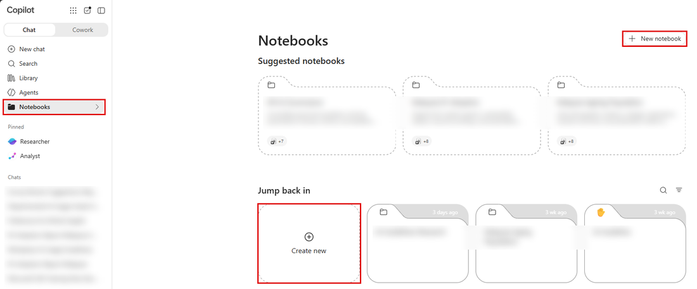

*Select Notebooks in the sidebar, then New notebook or Create new.*

3. In the **Add to** dialog, stay on the **References** tab and tick the material you want Copilot to work from. Copilot lists your recent files, and you can filter by **Files**, **Meetings**, **Emails**, **Sites** or **Teams Chats**. Select **Create** when you are done.

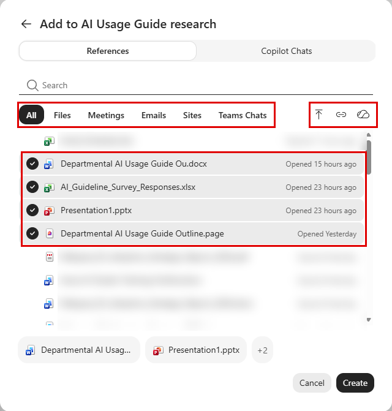

*The References tab, with the filter tabs, the Upload files, Link and OneDrive files buttons, and the workshop files selected.*

You can add more references later with **Add references** in the notebook's **Content** pane on the right.

### Ways to add references

| Method | How |
|--------|-----|
| **Suggestions** | Tick files, meetings, emails, sites or Teams chats from the list Copilot shows |
| **Upload files** | Select the upload icon and choose a file from your computer |
| **OneDrive files** | Select the cloud icon, find the file, then add it |
| **Link** | Select the link icon and paste a link to a file or page |
| **Move a chat** | From the sidebar, open a chat's **…** menu and choose **Move to notebook**, or use the **Copilot Chats** tab when adding content |

Notebooks accept Word, PowerPoint, Excel and PDF files, Loop components, Copilot Pages and OneNote pages, as well as Outlook emails.

### Give the notebook instructions

Open the notebook's **…** menu (top right) and select **Instructions** to tell Copilot how to behave in this notebook only, for example the audience you are writing for, or a format to follow. Type them into **Tell Copilot how to respond** and select **Save**. This works like the custom instructions you set in Topic 01, but only for this project, and the instructions apply to everyone you share the notebook with.

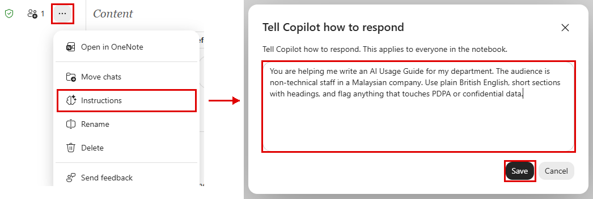

*The notebook's … menu, then Instructions, with sample instructions entered.*

> **License note:** Copilot Notebooks need a Microsoft 365 Copilot (Premium) license, and Microsoft is rolling them out to Copilot Chat (Basic) users through 2026. If you do not see Notebooks in your sidebar yet, keep working in a single chat for this topic.

> **Try it:** create a notebook called *AI Usage Guide research*, move your research chat into it, add the [Data_Privacy_AI_Acceptable_Use_Policy.pdf](./Data_Privacy_AI_Acceptable_Use_Policy.pdf) as a reference, then run Part 9 of the prompts.

---

## Copilot Pages — The Link to Topic 04

Once you have useful research in Copilot Chat, you have two ways to move it into a document:

**Option 1 — Edit in Pages:** Click **...** under any response → **Edit in Pages** → **Add to new page** to open it as a live Copilot Page for collaborative editing.

**Option 2 — Export to Word:** Click **...** under the response → **Export to** → **Word**.

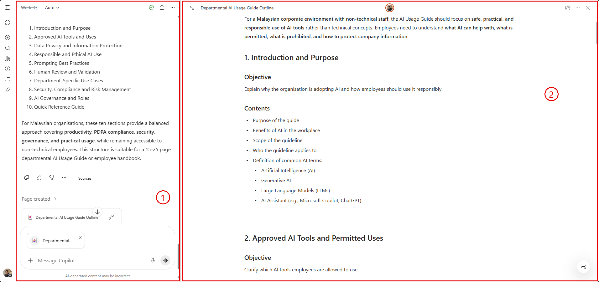

*A Copilot Page in action — the chat continues on the left, the editable document on the right*

Topic 04 covers Copilot Pages in detail. The research you build here is the raw material you will shape into your AI Usage Guide draft there.

---

## Tips for Research in Copilot Chat

- Start broad, then narrow. Get a high-level overview first, then use follow-up prompts to go deeper on specific sections.
- Stay in the same conversation rather than starting new chats — Copilot builds on earlier context and your research stays connected.
- If Copilot cites sources in Web mode, check them. Live search results are usually accurate but not always — verify anything you plan to include in your guide.
- Save prompts that work well using the bookmark icon so you can reuse them in future sessions.
- Use the **Edit** button on your prompts to refine and resubmit without retyping from scratch.
- When you have enough research, use the consolidation prompt in [prompts.md](./prompts.md) to turn your notes into a structured outline before moving to Pages.
