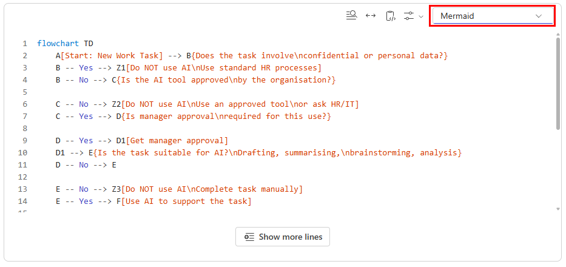

# 04 — Copilot Pages

Copilot Pages is where your research becomes a document. Think of it as a collaborative canvas — you pull content from Copilot Chat into a live page, edit it, refine it with Copilot, and share it with your team in real time.

> **Prompts to Try:** Open the [copy-paste prompt exercises](https://github.com/Asraf-JS/M365-Copilot-Workshop/blob/main/04-copilot-pages/prompts.md) for this topic.

---

## Continuing from Topic 03

At the end of Topic 03 you ran the consolidation prompt (Part 8) which produced a structured outline of your research. That outline is your starting point here.

**If you are still in the same Copilot Chat session:**
Click the **Edit in Pages** button (pencil icon) on the consolidation response. This opens your outline as a live Copilot Page. You are ready to start Topic 04.

**If you closed the session or started a new chat:**
1. Open a new Copilot Chat
2. Paste your research outline into the message box
3. Submit the Part 2 draft prompt from [prompts.md](./prompts.md)
4. Click **Edit in Pages** on the response

**If you did not complete Topic 03:**
Go to [prompts.md](./prompts.md) Part 2 and submit the draft prompt directly in Copilot Chat. It will generate a draft from scratch. Click **Edit in Pages** on the response and continue from there.

> **Important:** Once you are in Copilot Pages, do all your refining work there. Do not start a new Copilot Chat session for each prompt — use the Copilot panel inside the Page so all your edits stay in one document.

---

## What is Copilot Pages?

Copilot Pages is built on **Microsoft Loop**. When you generate content in Copilot Chat, clicking **Edit in Pages** creates a Loop page that:

- Stays live and editable — you and teammates can edit simultaneously
- Syncs across Microsoft 365 — share it in Teams and people can edit it right there
- Can be exported to Word or PDF when you are done
- Saves automatically to your Microsoft 365 account

---

## Pages vs Word

| | Copilot Pages | Microsoft Word |
|--|---------------|----------------|
| Best for | Collaborative drafting and live editing | Final polished documents |
| Real-time co-editing | Yes | Yes, but less fluid |
| Copilot integration | Built-in panel | Built-in panel |
| Export options | Word, PDF, copy to clipboard | PDF and various formats |
| Feels like | A wiki or Notion page | A traditional document |

Use Pages to build and refine your draft. Use Word for the final version you will submit for approval.

---

## Workshop Scenario

Your research from Topic 03 is now in Copilot Pages as a structured outline. Your goal in this topic is to turn that outline into a proper first draft of the AI Usage Guide, refine it section by section using Copilot, add a visual decision flowchart using Mermaid, and export it to Word ready for Topic 05.

---

## Creating a Mermaid Diagram in Pages

Copilot Pages supports Mermaid syntax for creating flowcharts and diagrams directly inside your document. This is useful for visualising your AI decision-making workflow without needing any drawing tools.

### What is Mermaid?

Mermaid is a text-based diagramming tool. You write simple instructions and it renders a visual diagram automatically. No drawing required.

### How to insert a Mermaid diagram in Pages

1. Place your cursor where you want the diagram
2. Type `/` to open the insert menu
3. Select **Code block**
4. In the language selector at the top right of the code block, change it to **Mermaid**



*The language selector (top right, highlighted in red) is where you switch to Mermaid. Use the Preview toggle to switch between code view and the rendered diagram.*

> **Common mistake:** When Copilot generates a Mermaid code block, it sometimes sets the language to "code" or leaves it blank. Always check the top right of the code block and change it to **Mermaid** if it is not already set. Otherwise the diagram will not render.

### Example diagram

```
flowchart TD
    A[Start: New Work Task] --> B{Does the task involve confidential or personal data?}
    B -- Yes --> Z1[Do NOT use AI. Use standard processes.]
    B -- No --> C{Is the AI tool approved by the organisation?}
    C -- No --> Z2[Do NOT use AI. Ask HR or IT for an approved tool.]
    C -- Yes --> D{Is manager approval required for this use?}
    D -- Yes --> D1[Get manager approval first]
    D1 --> E{Is the task suitable for AI?}
    D -- No --> E
    E -- No --> Z3[Do NOT use AI. Complete the task manually.]
    E -- Yes --> F[Use AI to support the task]
    F --> G[Review and verify the output before using it]
```

---

## Exporting from Pages

When your draft is ready to move to Word:

1. Click the **...** menu at the top right of your Page
2. Select **Export**
3. Choose **Word document (.docx)**

You will use this Word document in Topic 05 to reformat it as a formal management proposal.

---

*Back to: [03 — Copilot Chat](../03-copilot-chat/) | Next: [05 — Copilot in Word](../05-copilot-word/)*
