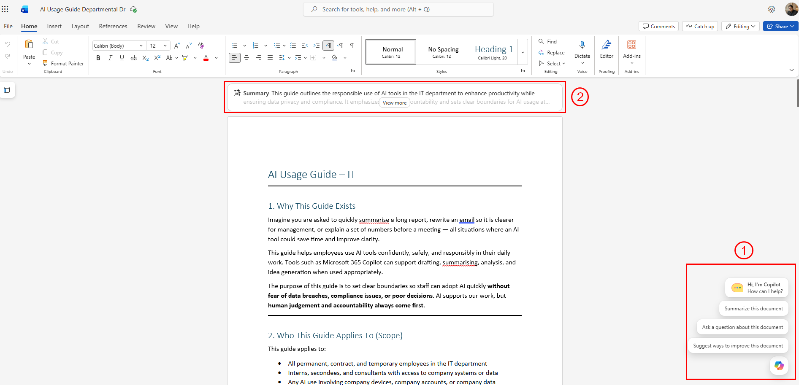
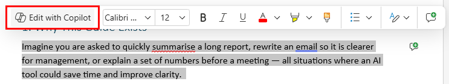

# 05 — Copilot in Word

You have built your AI Usage Guide draft in Copilot Pages. Now it is time to turn it into a formal proposal document you can submit to your supervisor or management team.

> **Prompts to Try:** Open the [copy-paste prompt exercises](./prompts.md) for this topic.

---

## Continuing from Topic 04

At the end of Topic 04 you exported your draft from Copilot Pages as a Word document. That Word file is your starting point here.

**If you have not exported from Pages yet:**
1. Open your Copilot Page from Topic 04
2. Click the **...** menu at the top right of the page
3. Select **Export** then **Word document (.docx)**
4. Save the file to your OneDrive or desktop
5. Open it in Microsoft Word

**If you cannot find your Pages document:**
Go to [m365.cloud.microsoft](https://m365.cloud.microsoft/), click the **...** menu at the top right, and select **Recent pages**. Your Topic 04 document should be listed there.

> Once the Word document is open, make sure you are connected to Microsoft 365 (signed in with your work account) so Copilot in Word is available. Look for the Copilot icon in the **Home** tab on the ribbon.

---

## What Copilot Can Do in Word

- Draft new content from a prompt
- Rewrite, shorten, or expand existing text
- Change the tone from casual to formal or vice versa
- Summarise long documents
- Generate tables, lists, and structured sections
- Reference other files from your Microsoft 365 account using the `/` key

---

## Three Ways to Use Copilot in Word

This is where participants often get confused. There are three separate Copilot entry points in Word and each does something different.

### 1. Copilot Chat panel (side panel)

Click the **Copilot** button in the **Home** tab on the ribbon to open the full Copilot Chat panel on the right side of the screen.

*Callout 1: the Copilot Chat panel opens on the right side. Callout 2: the document summary bar appears at the top of the document when the panel is open.*

Use the Chat panel for:

- Restructuring the entire document
- Adding new sections that do not exist yet
- Referencing other files from OneDrive or SharePoint using `/`
- Asking broad questions about the document as a whole
- Generating a summary or cover page

The panel can see the whole document, not just the section you are in.

### 2. Edit with Copilot (highlight to edit)

Select any text in your document and a mini toolbar appears above it. Click **Edit with Copilot** to open an inline prompt box targeting just that selection.

*Select any text and click Edit with Copilot in the mini toolbar to rewrite just that selection.*

Use this for:

- Rewriting or improving a specific paragraph
- Changing the tone of one section without affecting the rest
- Shortening or expanding a particular piece of text
- Fixing a sentence that does not read well

This is the most precise entry point since it only acts on exactly what you have selected.

### 3. Copilot icon in the margin

When you click at the start of a blank line or paragraph, a small Copilot icon appears in the left margin. Clicking it lets you generate new content at that position. Use this for inserting new sections or adding content between existing paragraphs.

> **Practical tip:** Start with the Chat panel for big structural changes. Use Edit with Copilot for targeted section rewrites. Use the margin icon when you need to insert something new in a specific place.

---

## Workshop Scenario

Your AI Usage Guide draft is now in Word. The goal here is to reframe and polish it as a **formal proposal** that your supervisor can read, approve, and sign off on.

A proposal has a different structure from a guideline. It needs to make a case for why this guide is necessary, what changes are needed to implement it, and what the expected outcome is. Copilot will help you add the missing sections and elevate the language to management level.

---

## Referencing Other Documents

If you have other files in your OneDrive or SharePoint, you can reference them directly in Copilot using the `/` key in the Chat panel. Type `/` and start typing the file name. Copilot will search your connected Microsoft 365 files and let you select one.

This is useful for checking your AI Usage Guide against existing company policies to make sure there are no conflicts.

---

## Tips for Working with Copilot in Word

- Use the **inline Copilot** (margin icon) for section-level edits and the **Chat panel** for document-wide tasks.
- Always review Copilot's output before finalising. It will sometimes rephrase things in ways that do not match your intended meaning.
- Turn on **Track Changes** (Review tab) before asking Copilot to make revisions so you can compare before and after and accept or reject changes selectively.
- If the document is very long, Copilot may not see all of it at once. Work section by section rather than asking it to revise everything in one prompt.
- Save regularly. Copilot edits in Word are not automatically undoable the same way typing is.

---

*Back to: [04 — Copilot Pages](../04-copilot-pages/) | Next: [06 — Copilot in Outlook](../06-copilot-outlook/)*
