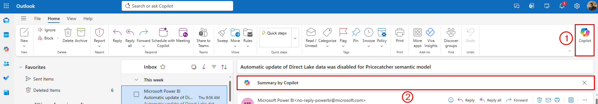
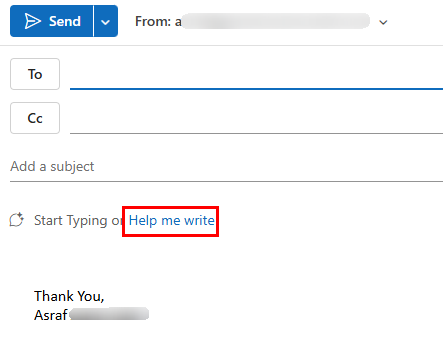

# 06 — Copilot in Outlook

Your proposal is ready. Now you need to send it to your supervisor and manage the conversation that follows. Copilot in Outlook helps you draft emails, summarise threads, and keep up with replies without spending half your day in your inbox.

> **Prompts to Try:** Open the [copy-paste prompt exercises](./prompts.md) for this topic.

---

## Continuing from Topic 05

At the end of Topic 05 you generated a handover note summarising your proposal in 5 bullet points. Use that as the basis for your submission email in this topic.

**If you saved the handover note:** paste it into the Copilot prompt when drafting your submission email and tell Copilot to turn it into a professional email.

**If you did not save it:** go back to your Word document, open the Copilot Chat panel, and run the Part 11 prompt from Topic 05 to regenerate it. Then come back here.

---

## What Copilot Can Do in Outlook

- Draft emails from a short description or bullet points
- Adjust tone, length, and formality of any email
- Summarise long email threads
- Suggest replies based on the context of a conversation
- Coach you on how your email might land with the reader

---

## Where to Find Copilot in Outlook

*Callout 1: the Copilot button in the top right of the ribbon opens the full Copilot panel. Callout 2: when you open an email, a "Summary by Copilot" bar appears at the top of the reading pane automatically.*

There are two main entry points for Copilot in Outlook:

| Entry point | Where to find it | Best for |
|-------------|-----------------|---------|
| **Copilot button** | Top right of the ribbon (Home tab) | Opening the full Copilot panel for chat, thread summary, and coaching |
| **Summary by Copilot** | Top of any open email | Quick summary of the selected email or thread |
| **Help me write** | Inside the new email compose window | Drafting a new email from a short description |
| **Reply with Copilot** | Reading pane when an email is selected | Drafting a reply with context from the thread |
| **Coaching by Copilot** | After drafting an email | Getting feedback on tone, clarity, and reader sentiment |

---

## Drafting a New Email

When you start a new email, look for the **Help me write** button in the compose window.

*The "Help me write" button appears in the compose window. Click it to open the Copilot drafting prompt.*

Click **Help me write**, describe what you want the email to say, and Copilot will generate a full draft. You can then refine it by asking Copilot to make it shorter, more formal, or to adjust the tone before sending.

---

## Workshop Scenario

You will send your AI Usage Guide proposal to your supervisor for approval, then manage the back-and-forth conversation using Copilot to draft replies, track what has been agreed, and finally announce the approved guideline to your team.

---

## Tips for Copilot in Outlook

- The **Help me write** button appears when you open a new email compose window. If you do not see it, check that you are using the new Outlook (not the classic version).
- For replies, select the email in the reading pane and look for **Reply with Copilot** or use the Copilot panel.
- Copilot automatically reads the email thread you have open, so it understands the context without you needing to explain it.
- Thread summaries are especially useful when you return from leave or need to catch up on a long conversation quickly.
- Use **Coaching by Copilot** before sending any important email, especially one going to senior management. It flags tone issues you might not notice yourself.

---

*Back to: [05 — Copilot in Word](../05-copilot-word/) | Next: [07 — Copilot in PowerPoint](../07-copilot-powerpoint/)*
