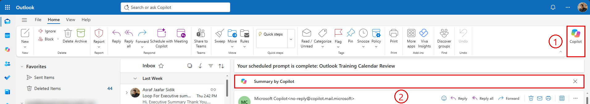
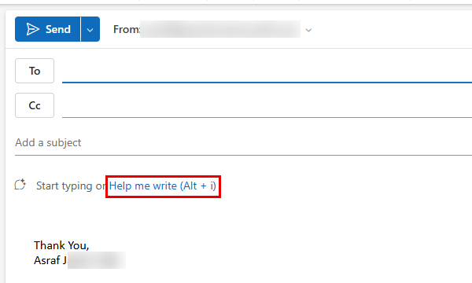
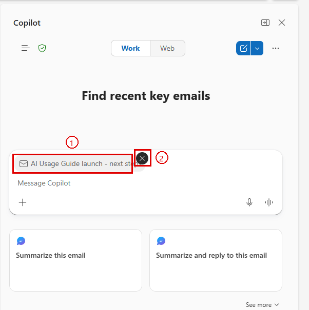
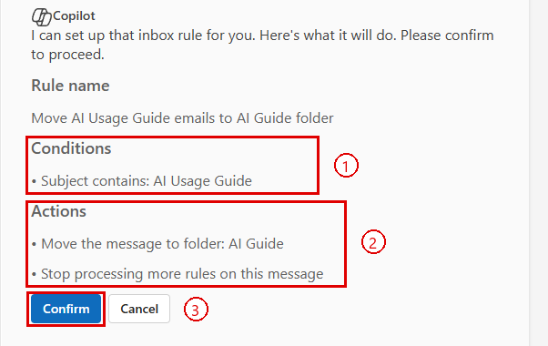
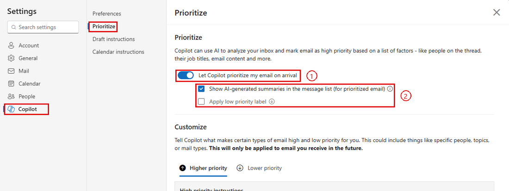
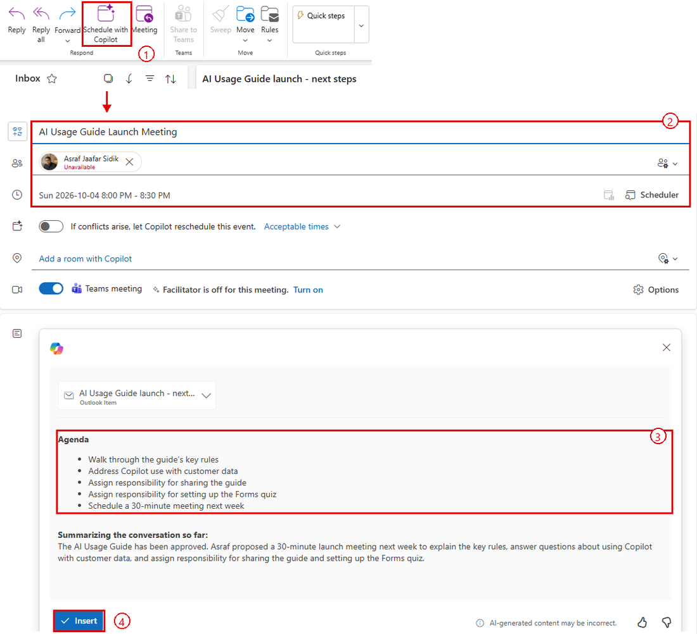

# 06 — Copilot in Outlook

Your proposal is ready. Now you need to send it to your supervisor and manage the conversation that follows. Copilot in Outlook helps you draft emails, summarise threads, and keep up with replies without spending half your day in your inbox.

> **Prompts to Try:** Open the [copy-paste prompt exercises](./prompts.md) for this topic.

---

## Continuing from Topic 05

At the end of Topic 05 you generated a handover note summarising your proposal in 5 bullet points. Use that as the basis for your submission email in this topic.

**If you saved the handover note:** paste it into the Copilot prompt when drafting your submission email and tell Copilot to turn it into a professional email.

**If you did not save it:** go back to your Word document, open the Copilot Chat panel, and run the Part 11 prompt from Topic 05 to regenerate it. Then come back here.

---

## What Copilot Can Do in Outlook

- Draft emails from a short description or bullet points
- Adjust tone, length, and formality of any email
- Summarise long email threads
- Suggest replies based on the context of a conversation
- Coach you on how your email might land with the reader
- Answer questions about your whole mailbox, not just the email you have open
- Tidy your inbox from a plain-language request: move, flag, categorise or archive emails, and set up inbox rules
- Prioritise incoming email as high, normal or low, with a reason
- Turn an email thread into a meeting invite with **Schedule with Copilot**

---

## Where to Find Copilot in Outlook

*Callout 1: the Copilot button in the top right of the ribbon opens the full Copilot panel. Callout 2: when you open an email, a "Summary by Copilot" bar appears at the top of the reading pane automatically.*

There are two main entry points for Copilot in Outlook:

| Entry point | Where to find it | Best for |
|-------------|-----------------|---------|
| **Copilot button** | Top right of the ribbon (Home tab) | Opening the full Copilot panel for chat, thread summary, and coaching |
| **Summary by Copilot** | Top of any open email | Quick summary of the selected email or thread |
| **Help me write** | Inside the new email compose window | Drafting a new email from a short description |
| **Reply with Copilot** | Reading pane when an email is selected | Drafting a reply with context from the thread |
| **Coaching by Copilot** | After drafting an email | Getting feedback on tone, clarity, and reader sentiment |

---

## Drafting a New Email

When you start a new email, look for the **Help me write** button in the compose window.

*"Start typing or Help me write" appears in the body of a new email. Click **Help me write** (or press Alt + I) to open the Copilot drafting prompt.*

Click **Help me write**, describe what you want the email to say, and Copilot will generate a full draft. You can then refine it by asking Copilot to make it shorter, more formal, or to adjust the tone before sending.

---

## Ask About Your Whole Mailbox

Open the **Copilot** pane with the **Copilot** button at the right end of the ribbon. If an email is open, Copilot attaches it to the prompt box and focuses on that thread. Hover over the email in the prompt box and select its **X** to remove it and ask about your whole mailbox instead, for example:

- *What do I need to reply to today?*
- *Has anyone replied about the AI Usage Guide since Monday?*
- *Find the email where my manager mentioned the approval deadline.*

*Callout 1: the open email, attached to the prompt box. Callout 2: the X that removes it, so Copilot searches your whole mailbox.*

> **Tip:** leave the email in the prompt when you want answers about that one conversation. Remove it when the answer could be anywhere in your mailbox.

---

## Tidy Your Inbox with Copilot

You can ask Copilot to do the housekeeping you would normally do by hand. Type what you want in the Copilot pane, in plain language:

- *Move all emails about the AI Usage Guide into a new folder called AI Guide.*
- *Flag the emails from my manager this week.*
- *Mark everything in the Newsletters folder as read.*
- *Categorise replies to my proposal as "Feedback".*

Copilot can pin, flag, mark as read or unread, archive, delete, move, copy and categorise emails, mark them as junk, and create folders.

### Inbox rules

Copilot can also create, list, change and delete **inbox rules**, so the same tidying happens automatically to future emails:

- *Create a rule that moves emails with "AI Usage Guide" in the subject to the AI Guide folder.*
- *Show me my inbox rules.*

Before it creates or changes a rule, Copilot shows a summary (the rule name, its **Conditions** and its **Actions**) and asks you to **Confirm** or **Cancel**. Like any inbox rule, it applies to email you receive from then on.

*Callout 1: the condition. Callout 2: the actions, including stopping any further rules for that message. Callout 3: Confirm. Nothing changes until you select it.*

> **Key point:** Copilot asks for confirmation before it acts on more than five emails or changes a rule. Read the summary before you confirm, especially anything that deletes email.

> **License note:** inbox actions and rules need a Microsoft 365 Copilot (Premium) license. Some actions may still be labelled **Frontier** (preview) in your tenant, so check with your trainer if a request is not recognised.

---

## Prioritize My Inbox

Copilot can sort incoming email by importance, marking each message **high**, **normal** or **low** priority based on who sent it and what it is about, with a short reason.

1. Open **Settings**: the gear icon at the top right, or **…** (top right) then **Settings** if the gear is hidden.
2. Select **Copilot**, then **Prioritize**, and turn on **Let Copilot prioritize my email on arrival**.
3. Optionally tick **Show AI-generated summaries in the message list** and **Apply low priority label**, then select **Save**.

*Callout 1: the Let Copilot prioritize my email on arrival toggle. Callout 2: its two options. Under Customize you can also tell Copilot what makes email higher or lower priority for you.*

The same Copilot settings section has **Draft instructions** (how Copilot should write for you, such as tone and sign-off) and **Calendar instructions**.

> **Good habit:** treat the priority as a suggestion. Spend a week checking what Copilot marks as low priority before you rely on it to decide what you can skip.

---

## Schedule with Copilot

When an email conversation needs a meeting, Copilot can set it up from the thread:

1. Open the email thread.
2. Select **Schedule with Copilot** in the **Respond** section of the ribbon. The meeting invitation opens in a new window.
3. Copilot drafts the meeting: subject, attendees from the thread, a suggested time when people are free, and a Copilot card with an **Agenda** and a summary of the conversation so far.
4. Select **Insert** to add the agenda and summary to the invitation, check the draft, change anything that is wrong, and send it.

*Callout 1: Schedule with Copilot in the ribbon. Callout 2: the drafted subject, attendees and time. Callout 3: Copilot's agenda. Callout 4: Insert, which adds the agenda to the invitation.*

You can also ask in the Copilot pane, for example *Find 30 minutes next week with everyone on this thread*. Copilot suggests the slots that suit the most people, within your working hours and time zone.

> **License note:** Schedule with Copilot needs a Microsoft 365 Copilot (Premium) license.

---

## Workshop Scenario

You will send your AI Usage Guide proposal to your supervisor for approval, then manage the back-and-forth conversation using Copilot to draft replies, track what has been agreed, and finally announce the approved guideline to your team. Along the way you will tidy the replies into their own folder and schedule the launch meeting you run in Topic 10.

---

## Tips for Copilot in Outlook

- The **Help me write** button appears when you open a new email compose window. If you do not see it, check that you are using the new Outlook (not the classic version).
- For replies, select the email in the reading pane and look for **Reply with Copilot** or use the Copilot panel.
- Copilot automatically reads the email thread you have open, so it understands the context without you needing to explain it.
- Thread summaries are especially useful when you return from leave or need to catch up on a long conversation quickly.
- Use **Coaching by Copilot** before sending any important email, especially one going to senior management. It flags tone issues you might not notice yourself.
- Remove the open email from the Copilot prompt box when you want to search your whole mailbox.
- Turn a one-off tidy-up into a rule once you find yourself asking for it twice.

---

*Back to: [05 — Copilot in Word](../05-copilot-word/) | Next: [07 — Copilot in PowerPoint](../07-copilot-powerpoint/)*
