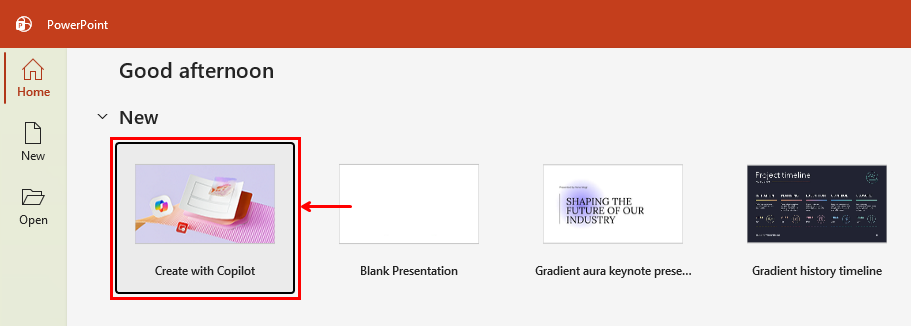
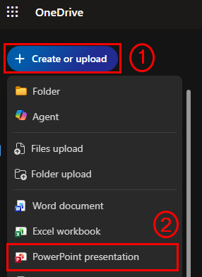
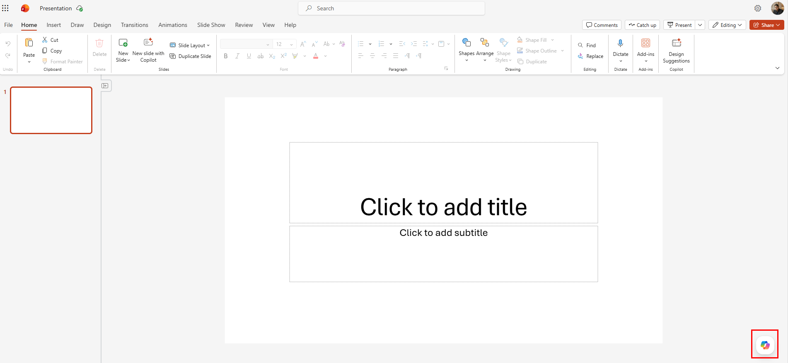
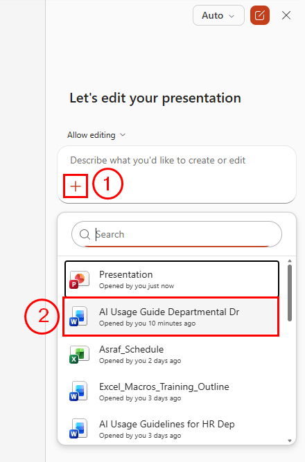
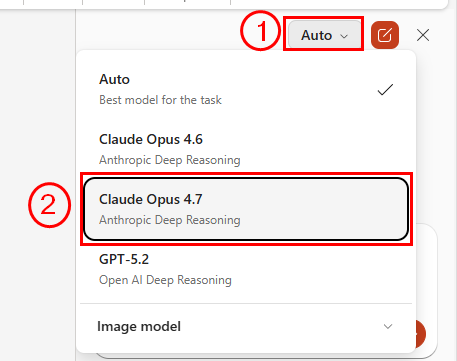
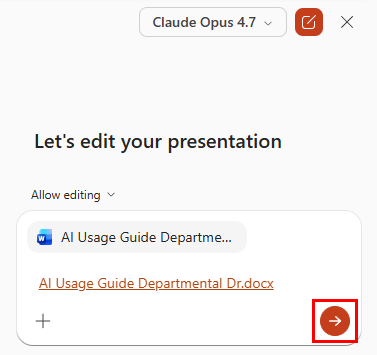
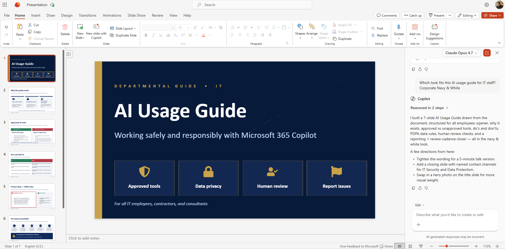

# 07 — Copilot in PowerPoint

Your proposal has been approved. Now you need to communicate the AI Usage Guideline to your team. A presentation is the clearest way to do this, and Copilot in PowerPoint can build it directly from your Word document.

> **Prompts to Try:** Open the [copy-paste prompt exercises](./prompts.md) for this topic.

---

## Continuing from Topic 06

Your proposal has been approved and you have sent the team announcement email. Now it is time to present the AI Usage Guideline to your department in person.

You will use the approved Word document from Topic 05 as the source. Copilot reads it and generates the slides automatically. The better your Word document, the better the generated presentation.

---

## What Copilot Can Do in PowerPoint

- Generate a full presentation from a Word document or a text prompt
- Add slides, rewrite slide content, and adjust layouts
- Suggest speaker notes for each slide
- Summarise presentations
- Help you change the overall tone or style

---

## Two Ways to Start a Presentation with Copilot

### Option 1: Create with Copilot from the PowerPoint home screen

When you open PowerPoint, the first option in the New section is **Create with Copilot**.

*Click "Create with Copilot" from the PowerPoint home screen to start a new presentation with Copilot from the beginning.*

### Option 2: Create from OneDrive

If you prefer to start from OneDrive, you can create a new PowerPoint presentation directly from there.

*In OneDrive, click "Create or upload" (callout 1) then select "PowerPoint presentation" (callout 2). The new file opens in PowerPoint online with Copilot available.*

---

## Creating a Presentation from Your Word Document

Once PowerPoint is open, look for the Copilot button. On a blank presentation it appears in the bottom right corner of the screen.

*The Copilot button appears in the bottom right corner of a blank presentation. Click it to open the Copilot panel.*

### Attaching your Word document

When the Copilot panel opens, click the **+** button to attach your Word document as the source.

*Click the + button (callout 1) to open the file picker. Your recently opened files appear automatically. Select your AI Usage Guide Word document (callout 2).*

### Switching models before generating

Before you submit, you can switch the AI model using the model selector at the top of the panel.

*Click Auto (callout 1) to open the model switcher. Claude Opus 4.7 (callout 2) is recommended for presentation generation as it produces more structured and well-reasoned slide content.*

> **Note:** Claude Opus is a preview feature in PowerPoint Copilot and may not be available on all tenants. If you do not see it, use Auto.

### Submitting and generating

After attaching your document and selecting your model, click the arrow button to generate the presentation.

*The Word document appears as an attachment in the panel. Click the arrow button to start generating the presentation.*

Copilot will read your entire Word document and build a structured slide deck. This usually takes 15 to 30 seconds.

### The completed presentation

*A completed 7-slide presentation generated from the AI Usage Guide Word document. The Copilot panel on the right shows the model response and suggests next steps like tightening wording or adding a closing slide.*

---

## Workshop Scenario

You are turning the approved AI Usage Guide into a presentation for your department team. The audience is non-technical staff who are new to using AI at work. The goal is to help them understand the guideline, feel positive about it, and know exactly what is expected of them.

---

## Tips for Copilot in PowerPoint

- The better your Word document, the better the generated presentation. Clean headings and clear sections in Word translate directly into well-structured slides.
- Copilot will apply your organisation's PowerPoint template if one is set up in your Microsoft 365 tenant. If not, you can apply a theme after generating.
- Speaker notes are often the most valuable output. Even if you adjust the slides manually, keep the notes as a script reference when presenting.
- Use **Design Suggestions** (also in the ribbon under Copilot) alongside the Copilot panel to improve visual layout after the content is generated.
- If you are not happy with the first result, you can ask Copilot to regenerate with different instructions rather than starting over.

---

*Back to: [06 — Copilot in Outlook](../06-copilot-outlook/) | Next: [08 — Copilot in Forms](../08-copilot-forms/)*
