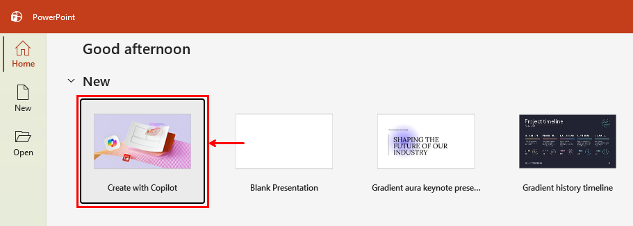
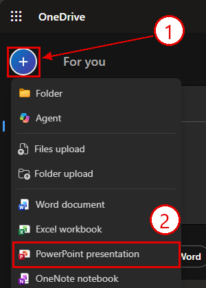
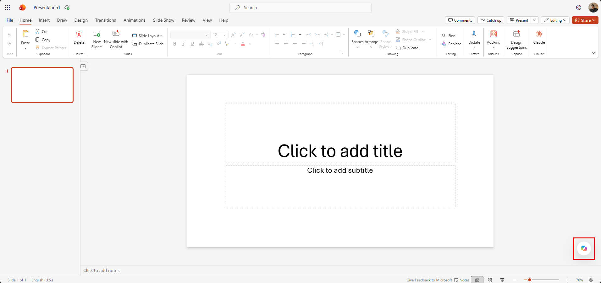
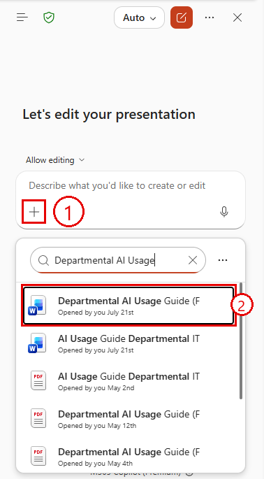
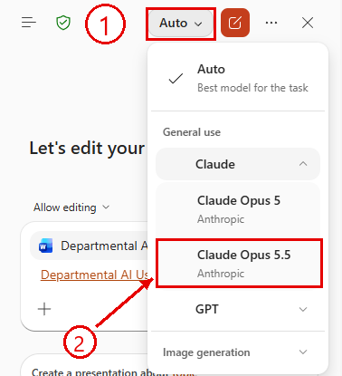
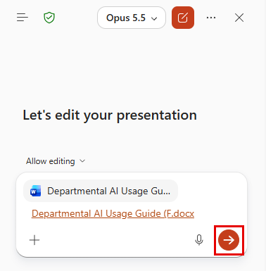
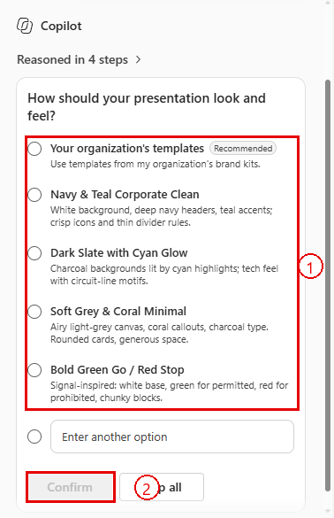
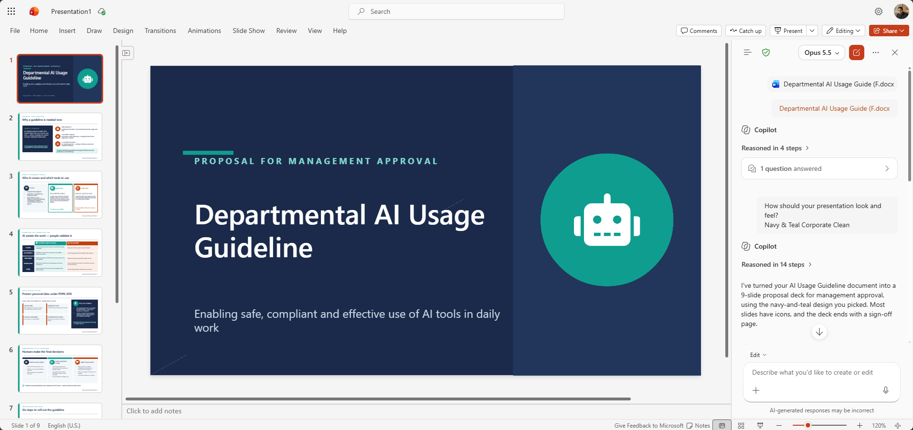
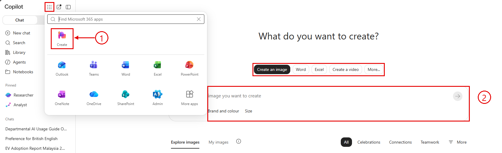
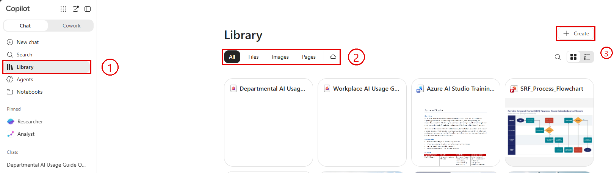

# 07 — Copilot in PowerPoint

Your proposal has been approved. Now you need to communicate the AI Usage Guideline to your team. A presentation is the clearest way to do this, and Copilot in PowerPoint can build it directly from your Word document.

> **Prompts to Try:** Open the [copy-paste prompt exercises](./prompts.md) for this topic.

---

## Continuing from Topic 06

Your proposal has been approved and you have sent the team announcement email. Now it is time to present the AI Usage Guideline to your department in person.

You will use the approved Word document from Topic 05 as the source. Copilot reads it and generates the slides automatically. The better your Word document, the better the generated presentation.

---

## What Copilot Can Do in PowerPoint

- Generate a full presentation from a Word document or a text prompt
- Add slides, rewrite slide content, and adjust layouts
- Suggest speaker notes for each slide
- Summarise presentations
- Help you change the overall tone or style

---

## Two Ways to Start a Presentation with Copilot

### Option 1: Create with Copilot from the PowerPoint home screen

When you open PowerPoint, the first option in the New section is **Create with Copilot**.



*Click "Create with Copilot" from the PowerPoint home screen to start a new presentation with Copilot from the beginning.*

### Option 2: Create from OneDrive

If you prefer to start from OneDrive, you can create a new PowerPoint presentation directly from there.



*In OneDrive, click the **+** (Create or upload) button (callout 1) then select "PowerPoint presentation" (callout 2). The new file opens in PowerPoint for the web with Copilot available.*

---

## Creating a Presentation from Your Word Document

Once PowerPoint is open, look for the round Copilot button. On a blank presentation it floats in the bottom right corner of the screen.



*The Copilot button appears in the bottom right corner of a blank presentation. Click it to open the Copilot panel.*

### Attaching your Word document

When the Copilot panel opens, click the **+** button and choose **Add work content** to attach your Word document as the source.



*Click + → Add work content (callout 1) to open the file picker. Recent files appear automatically, or type in the search box to find yours. Select your AI Usage Guide Word document (callout 2). The + menu also offers Upload images and files, Designer, Select brand, Choose skills, and Change data sources.*

### Switching models before generating

Before you submit, you can switch the AI model using the model selector at the top of the panel.



*Click Auto (callout 1) to open the model switcher, expand **Claude**, and pick **Claude Opus 5.5** (callout 2). Opus is recommended for presentation generation as it produces more structured and well-reasoned slide content. The menu also lists GPT models and an Image generation option.*

> **Note:** The Claude models may not be available on all tenants. If you do not see them, use Auto.

### Submitting and generating

After attaching your document and selecting your model, click the arrow button to generate the presentation.



*The Word document appears as an attachment in the panel, and the model button now shows Opus 5.5. Click the arrow button to start generating the presentation.*

Copilot reads your entire Word document and first asks **how the presentation should look and feel**. Pick one of the suggested styles (or your organisation's templates, or type your own) and click **Confirm** — or click **Skip all** to let Copilot decide.



*Callout 1: suggested looks, with your organisation's templates recommended first. Callout 2: Confirm your choice.*

Copilot then builds a structured slide deck. This usually takes 2 to 4 minutes.

### The completed presentation



*A completed 9-slide presentation generated from the AI Usage Guide Word document in the Navy & Teal style. The Copilot panel on the right shows the style you chose and a summary of what Copilot built.*

---

## Workshop Scenario

You are turning the approved AI Usage Guide into a presentation for your department team. The audience is non-technical staff who are new to using AI at work. The goal is to help them understand the guideline, feel positive about it, and know exactly what is expected of them.

---

## Create and Library in Copilot Chat

Alongside the presentation itself, Copilot Chat has two features worth knowing when building visual content for your slides: **Create** and **Library**.

### Create — AI image generation



*Callout 1: Create, opened from the apps grid (the dotted square next to the Copilot logo). Callout 2: the format tabs and the image description prompt box. The tabs let you switch between creating an image, a Word document, an Excel spreadsheet, a video, and more (under More...).*

**Create** is opened from the apps grid at the top of the sidebar in Copilot Chat at [m365.cloud.microsoft](https://m365.cloud.microsoft/), or from the **+ Create** button in Library. It lets you generate images from a text description, which you can then insert into your PowerPoint slides.

**Important — image generation uses a different model than chat.** When you are chatting with Copilot, you can switch between Claude Opus, GPT, and other models. Image generation does not use those models. It uses OpenAI's **GPT-Image-1.5**, which is a dedicated image generation model separate from the chat models. Switching your chat model to Opus does not affect how images are generated.

**Example prompts for image generation:**

```
A professional office team collaborating around a laptop, 
modern Malaysian corporate setting, natural lighting, 
photorealistic style.
```

```
A simple infographic-style illustration showing a shield 
icon representing data privacy, blue and teal colour scheme, 
clean minimal style, no text.
```

```
A split image showing two scenarios side by side: on the 
left, a stressed employee with piles of paper; on the right, 
the same employee relaxed at a clean desk using a laptop. 
Corporate illustration style.
```

```
A flowchart diagram showing an AI decision process with 
diamond decision nodes and rectangular action nodes, 
teal and navy colour scheme, white background.
```

> **Tip for presentations:** Generate images in a wide (16:9) format to match standard PowerPoint slide dimensions. Use the **Size** option below the prompt box to set this before generating.

### Library — your saved images and prompts



*Callout 1: Library in the left sidebar. Callout 2: filter by All, Files, Images, or Pages. Callout 3: the + Create button. Your generated images, files, and Pages are stored here and accessible across sessions.*

**Library** stores all images you have generated through Create, as well as any prompts you have saved from Copilot Chat. It is accessible from the left sidebar at any time. Images are stored for 18 months before being automatically deleted.

Use Library to:
- Find images you generated in a previous session without regenerating them
- Access saved prompts from Topic 02 exercises
- Reuse visuals across multiple presentations or documents

---

## Why Copilot-generated slides don't work with templates

When Copilot builds a presentation, it places content using text boxes rather than PowerPoint's built-in layouts and placeholders. The slides look fine on screen, but when you apply a corporate template, nothing snaps into place. Fonts, colours, and positioning all have to be fixed manually because the slide structure doesn't match what the template expects.

The way around this is to use PowerPoint VBA to build the presentation instead. VBA can create slides using proper layouts, fill real placeholders, insert native charts and tables, and respect the active theme. The result is a presentation that works correctly with any template from the start.

The prompt in Part 5 walks you through this with a step-by-step workflow: you describe your presentation to an AI assistant, it produces a slide-by-slide blueprint for you to review, and only after you approve the outline does it generate the VBA code. You then paste that code into PowerPoint and run it.

> **Note:** This approach works in PowerPoint 365 desktop. You will need to enable the Developer tab to access the VBA editor. Go to File > Options > Customise Ribbon and check the Developer box.

---

## Tips for Copilot in PowerPoint

- The better your Word document, the better the generated presentation. Clean headings and clear sections in Word translate directly into well-structured slides.
- Copilot will apply your organisation's PowerPoint template if one is set up in your Microsoft 365 tenant. If not, you can apply a theme after generating.
- Speaker notes are often the most valuable output. Even if you adjust the slides manually, keep the notes as a script reference when presenting.
- Use **Design Suggestions** (also in the ribbon under Copilot) alongside the Copilot panel to improve visual layout after the content is generated.
- If you are not happy with the first result, you can ask Copilot to regenerate with different instructions rather than starting over.

---

*Back to: [06 — Copilot in Outlook](../06-copilot-outlook/) | Next: [08 — Copilot in Forms](../08-copilot-forms/)*
