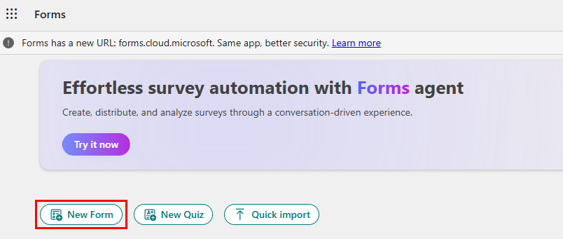
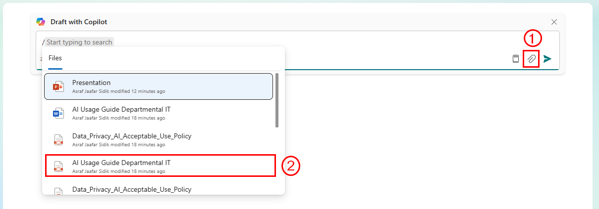
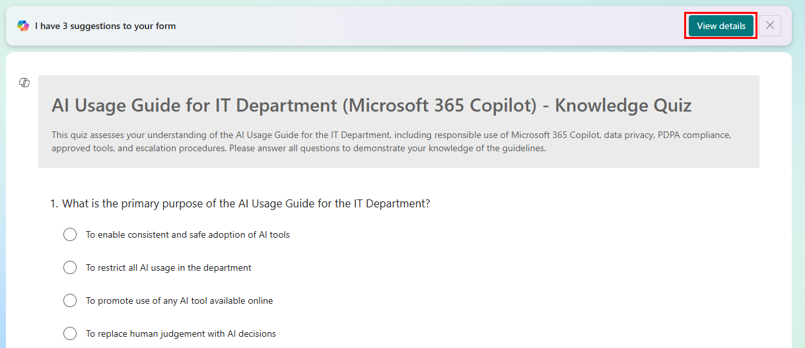
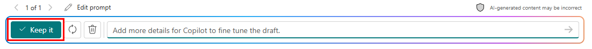
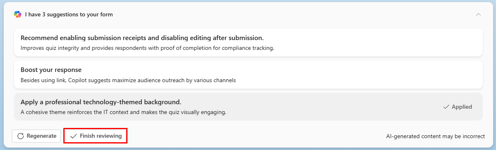
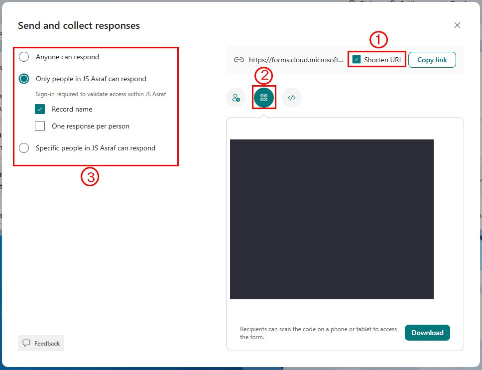
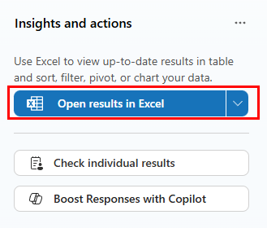

# 08 — Copilot in Forms

Your AI Usage Guideline has been presented to the team. Now you want to know two things: do they understand it, and is it actually useful? Copilot in Forms lets you build both a knowledge quiz and a feedback survey from your guideline document in minutes.

> **Prompts to Try:** Open the [copy-paste prompt exercises](./prompts.md) for this topic.

---

## Continuing from Topic 07

You have the approved AI Usage Guide as a Word document and a PDF export. In this topic you will feed that document into Copilot in Forms to generate two things:

1. A **knowledge quiz** to check whether staff have understood the key rules
2. A **feedback survey** to find out whether the guideline is practical and clear

The responses you collect will be exported to Excel and analysed in Topic 09. You do not need to wait for real responses — the workshop sample dataset is pre-populated and ready to use.

> **Before you start:** Make sure your AI Usage Guide is saved to your OneDrive. Copilot in Forms pulls files directly from your Microsoft 365 account. If you only have it on your desktop, upload it to OneDrive first.

---

## What Copilot Can Do in Forms

- Generate a complete form or quiz from a document or text prompt
- Suggest question types (multiple choice, rating scale, Likert, open text)
- Recommend improvements to your form after generation
- Help you phrase questions clearly and without bias
- Distribute the form via link, QR code, or email

---

## Getting Started: The Forms Home Screen

Access Microsoft Forms at [forms.cloud.microsoft](https://forms.cloud.microsoft/).

*The Forms home screen. Click **New Form** to create a feedback survey or **New Quiz** to create a scored knowledge check. Quick Import lets you import questions from an existing Excel file.*

For this workshop you will use **New Quiz** for the knowledge check and a separate **New Form** for the feedback survey.

---

## Step 1: Attach Your AI Usage Guide

When the form or quiz editor opens, click **Draft with Copilot** and attach your document.

*Callout 1: the paperclip icon to attach a file from your Microsoft 365 account. Callout 2: your AI Usage Guide PDF or Word document appears in the file list. Select it as the source for Copilot to generate questions from.*

---

## Step 2: Review the Generated Form

After Copilot generates the form, it shows you the draft with a suggestion banner at the top.

*Copilot generates the form and shows a "I have 3 suggestions" banner. Click **View details** to see what Copilot recommends improving.*

At the bottom of the screen, you can refine the draft, regenerate it entirely, or keep it if you are happy.

*The bar at the bottom lets you keep the current draft, regenerate it, delete it, or add more details to fine-tune before keeping.*

---

## Step 3: Review and Apply Suggestions

*Copilot's suggestions for the form. In this example it recommends enabling submission receipts, boosting responses through multiple channels, and applying a professional theme. Click **Finish reviewing** once you have applied or dismissed the suggestions.*

---

## Step 4: Collect Responses

Once you are satisfied with the form, click **Collect responses** in the top bar.

*The Collect responses button in the top navigation bar.*

This opens the distribution panel where you can configure how responses are collected.

*The Send and collect responses panel:*
- *Callout 1: **Shorten URL** gives you a compact link to share via email, Teams, or chat*
- *Callout 2: **QR code** — download and display it during your presentation so participants can respond immediately on their phones*
- *Callout 3: **Access control** — choose between anyone, only people in your organisation, or specific people. For a staff knowledge check, set it to your organisation only and enable "Record name" so you know who has completed it*

---

## Step 5: View Responses

After responses come in, click **View responses** in the top bar.

*The View responses tab shows a live summary of all responses as they come in.*

---

## Step 6: Export to Excel for Topic 09

This step is important. The Excel file you export here is what you will use for analysis in Topic 09.

*In the Insights panel, click **Open results in Excel** to export all responses as a spreadsheet.*

**Where to find the Excel file after exporting:**

When you click Open results in Excel, Microsoft Forms saves the file automatically to your **OneDrive** in a folder called **Documents**. The file is named after your form title. It will also open immediately in Excel online.

To find it later:
1. Go to [onedrive.live.com](https://onedrive.live.com/) or open OneDrive from the Microsoft 365 app launcher
2. Navigate to **Documents**
3. Look for a file with your form title ending in `.xlsx`

> **For the workshop:** If you do not have real responses yet, use the pre-populated sample file `AI_Guideline_Survey_Responses.xlsx` from the `09-copilot-excel` folder in the workshop GitHub repo. It contains 30 simulated responses across 8 departments and is ready to use in Topic 09.

---

## Tips for Copilot in Forms

- Generating from a document gives much better and more specific questions than generating from a text prompt alone. Always attach the source document.
- If Copilot generates questions that are too technical for your audience, ask it to simplify the language before keeping the draft.
- For a knowledge quiz, set the correct answers after generating. Copilot generates the questions and options but does not always mark the correct answer.
- Use the QR code option when presenting live so participants can respond on their phones immediately after the session.
- The Excel export updates automatically as new responses come in. You do not need to re-export every time.

---

*Back to: [07 — Copilot in PowerPoint](../07-copilot-powerpoint/) | Next: [09 — Copilot in Excel](../09-copilot-excel/)*
