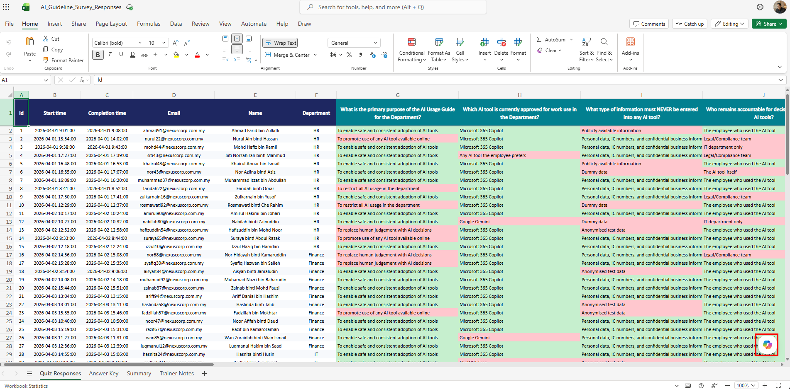
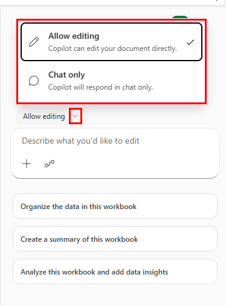
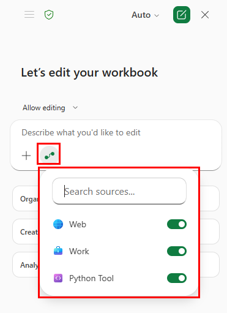
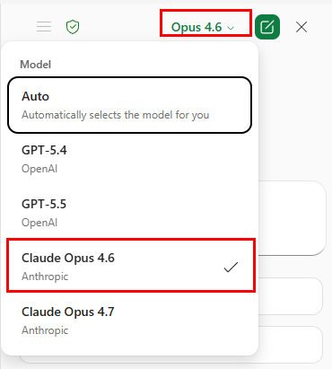
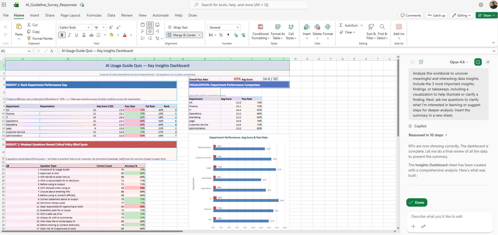

# 09 — Copilot in Excel

You have quiz response data from Topic 08. Now you will use Copilot in Excel to analyse it, clean it, spot patterns, and even run Python code — all through natural language prompts.

> **Prompts to Try:** Open the [copy-paste prompt exercises](./prompts.md) for this topic.

---

## Continuing from Topic 08

At the end of Topic 08 you exported your Forms responses as an Excel file saved to OneDrive. Open that file now in Microsoft Excel (desktop app, not browser) to get full Copilot functionality.

**If you do not have real response data:** download the sample file below and open it in Excel. It contains 100 simulated quiz responses across 8 departments with realistic Malaysian names and varied correct/incorrect answer patterns.

> **Sample data:** [AI_Guideline_Survey_Responses.xlsx](./AI_Guideline_Survey_Responses.xlsx)

The workbook has 4 sheets:
- **Quiz Responses:** 100 rows of quiz answers. Green cells are correct, red cells are incorrect.
- **Answer Key:** the correct answer for each of the 20 questions.
- **Summary:** pre-built stats by department and question accuracy.
- **Trainer Notes:** guidance on using the file for each exercise.

---

## What Copilot Can Do in Excel

- Analyse data and surface key insights in plain language
- Create PivotTables and charts from a natural language description
- Write and explain formulas
- Add new columns with calculated values
- Highlight patterns, outliers, and trends
- Generate a full summary report in a new sheet
- Run Python code for advanced analysis and visualisation

---

## Opening Copilot in Excel

*The AI_Guideline_Survey_Responses workbook open in Excel. The Quiz Responses sheet shows 100 rows with green (correct) and red (incorrect) answer colour coding across 20 question columns.*

Open Copilot from the **Home** tab in the ribbon. The Copilot panel opens on the right side of the screen.

---

## Allow Editing vs Chat Only

When the Copilot panel opens, you will see two modes at the top.

*Allow editing lets Copilot make changes directly to your workbook. Chat only keeps Copilot responses in the panel without touching the spreadsheet. The panel also shows suggested starter prompts.*

| Mode | What it does | Use when |
|------|-------------|---------|
| **Allow editing** | Copilot can add columns, create sheets, insert charts, and write formulas directly into the workbook | You want Copilot to do the work for you |
| **Chat only** | Copilot responds in the panel but does not change the workbook | You want to ask questions or get explanations without modifying anything |

For most exercises in this topic, use **Allow editing**.

---

## Sources: Web, Work, and Python Tool

Click the sources icon in the Copilot panel to see what Copilot can access.

*The sources panel shows three toggles: Web (search the internet), Work (your Microsoft 365 data), and Python Tool (run Python code directly in Excel). Make sure Python Tool is enabled for Exercise 4.*

---

## Switching Models

Click the model name at the top of the Copilot panel to switch models.

*Claude Opus 4.6 is selected here. For data analysis and insight generation, Opus tends to produce more thorough and better-reasoned analysis than the default Auto model.*

---

## Workshop Exercises

This topic has four exercises. Each builds on the previous one. Work through them in order.

**Exercise 1:** Generate insights and an insights dashboard from the quiz data.
**Exercise 2:** Transform and clean the data by adding calculated columns.
**Exercise 3:** Identify patterns and weak areas across departments and questions.
**Exercise 4:** Use Python in Excel to generate a score distribution chart.

See [prompts.md](./prompts.md) for the detailed prompts for each exercise.

---

## What a Completed Insights Dashboard Looks Like

*A completed Insights Dashboard sheet generated by Copilot in Excel. It includes overall pass rate and average score KPIs, a department performance table with colour-coded pass rates, a question accuracy table identifying weak areas, and a bar chart comparing departments. The Copilot panel on the right shows the prompt used and the model response.*

This is the target output for Exercise 1. Your dashboard may look slightly different depending on your data and the model you use.

---

## Tips for Copilot in Excel

- Make sure your data is formatted as an **Excel Table** (Ctrl+T) before using Copilot. Copilot works best with structured tables.
- If Copilot asks for clarification about which data to use, click on the relevant table or sheet first to give it context.
- Use **Allow editing** for building outputs and **Chat only** for asking questions without changing the workbook.
- For complex analysis tasks, switch to **Claude Opus** for more thorough reasoning.
- The Python Tool toggle must be enabled in Sources before you can run Python code exercises.
- Save your workbook regularly. Copilot edits cannot always be undone with Ctrl+Z.

---

*Back to: [08 — Copilot in Forms](../08-copilot-forms/) | Next: [10 — Copilot Studio Intro](../10-copilot-studio-intro/)*
