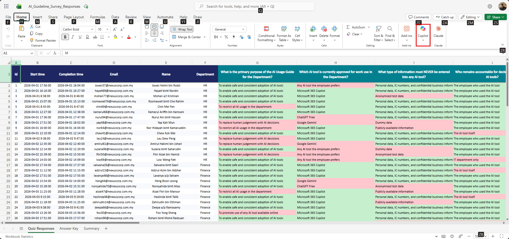
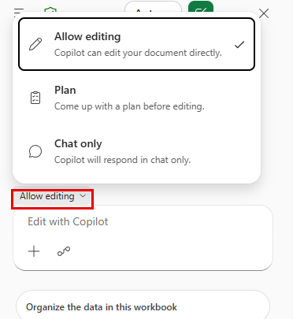
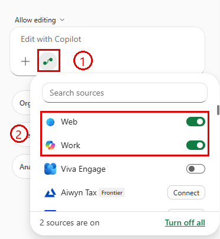
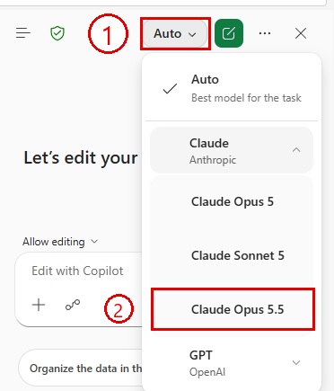
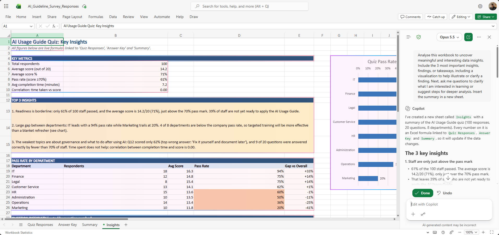

# 09 — Copilot in Excel

You have quiz response data from Topic 08. Now you will use Copilot in Excel to analyse it, clean it, spot patterns, and even run Python code — all through natural language prompts.

> **Prompts to Try:** Open the [copy-paste prompt exercises](./prompts.md) for this topic.

---

## Continuing from Topic 08

At the end of Topic 08 you exported your Forms responses as an Excel file saved to OneDrive. Open that file now in Microsoft Excel (desktop app, not browser) to get full Copilot functionality.

**If you do not have real response data:** download the sample file below and open it in Excel. It contains 100 simulated quiz responses across 8 departments with realistic Malaysian names and varied correct/incorrect answer patterns.

> **Sample data:** [AI_Guideline_Survey_Responses.xlsx](./AI_Guideline_Survey_Responses.xlsx)

The workbook has 3 sheets:
- **Quiz Responses:** 100 rows of quiz answers. Green cells are correct, red cells are incorrect.
- **Answer Key:** the correct answer for each of the 20 questions.
- **Summary:** pre-built stats by department and question accuracy.

---

## What Copilot Can Do in Excel

- Analyse data and surface key insights in plain language
- Create PivotTables and charts from a natural language description
- Write and explain formulas
- Add new columns with calculated values
- Highlight patterns, outliers, and trends
- Generate a full summary report in a new sheet
- Run Python code for advanced analysis and visualisation

---

## Opening Copilot in Excel

*The AI_Guideline_Survey_Responses workbook open in Excel for the web. The Quiz Responses sheet shows 100 rows with green (correct) and red (incorrect) answer colour coding. The Copilot button is highlighted on the Home tab.*

Open Copilot from the **Copilot** button on the **Home** tab of the ribbon. The Copilot panel ("Let's edit your workbook") opens on the right side of the screen. If it opens on an earlier conversation, click the new chat icon at the top of the panel.

---

## Allow Editing, Plan, and Chat Only

When the Copilot panel opens, click the mode drop-down (it shows **Allow editing** by default) just above the Copilot box to choose how much Copilot can change.

*Allow editing lets Copilot make changes directly to your workbook. Plan has Copilot propose a plan before it edits anything. Chat only keeps Copilot responses in the panel without touching the spreadsheet.*

| Mode | What it does | Use when |
|------|-------------|---------|
| **Allow editing** | Copilot can add columns, create sheets, insert charts, and write formulas directly into the workbook | You want Copilot to do the work for you |
| **Plan** | Copilot comes up with a step-by-step plan for you to review before it edits | You want to check Copilot's approach before it changes a workbook |
| **Chat only** | Copilot responds in the panel but does not change the workbook | You want to ask questions or get explanations without modifying anything |

For most exercises in this topic, use **Allow editing**.

---

## Sources: Web, Work, and connectors

Click the sources icon (next to + in the Copilot box) to see what Copilot can access.

*Callout 1: the sources icon. Callout 2: the Web (search the internet) and Work (your Microsoft 365 data) toggles. Below them are any connectors your organisation has enabled. There is no separate Python Tool toggle any more — for Exercise 4, simply ask Copilot to use Python in your prompt.*

---

## Switching Models

Click the model button (Auto by default) at the top of the Copilot panel to switch models.

*Click Auto (callout 1), expand Claude, and choose Claude Opus 5.5 (callout 2). For data analysis and insight generation, Opus tends to produce more thorough and better-reasoned analysis than the default Auto model.*

---

## Workshop Exercises

This topic has four exercises. Each builds on the previous one. Work through them in order.

**Exercise 1:** Generate insights and an insights dashboard from the quiz data.
**Exercise 2:** Transform and clean the data by adding calculated columns.
**Exercise 3:** Identify patterns and weak areas across departments and questions.
**Exercise 4:** Use Python in Excel to generate a score distribution chart.

See [prompts.md](./prompts.md) for the detailed prompts for each exercise.

---

## What a Completed Insights Dashboard Looks Like

*A completed Insights sheet generated by Copilot (Claude Opus 5.5) in Excel. It includes key metrics such as pass rate and average score, the top 3 insights, a pass rate by department table with colour-coded gaps, a question difficulty table, and a bar chart comparing departments. The Copilot panel on the right shows the prompt used, the model response, and Done / Undo buttons to keep or reverse the changes.*

This is the target output for Exercise 1. Your dashboard may look slightly different depending on your data and the model you use.

---

## Tips for Copilot in Excel

- Make sure your data is formatted as an **Excel Table** (Ctrl+T) before using Copilot. Copilot works best with structured tables.
- If Copilot asks for clarification about which data to use, click on the relevant table or sheet first to give it context.
- Use **Allow editing** for building outputs and **Chat only** for asking questions without changing the workbook.
- For complex analysis tasks, switch to **Claude Opus** for more thorough reasoning.
- For Python exercises, ask for Python explicitly in your prompt (for example, "Use Python to..."). There is no separate Python Tool toggle in Sources any more.
- Save your workbook regularly. Copilot edits cannot always be undone with Ctrl+Z.

---

*Back to: [08 — Copilot in Forms](../08-copilot-forms/) | Next: [10 — Copilot Studio Intro](../10-copilot-studio-intro/)*
