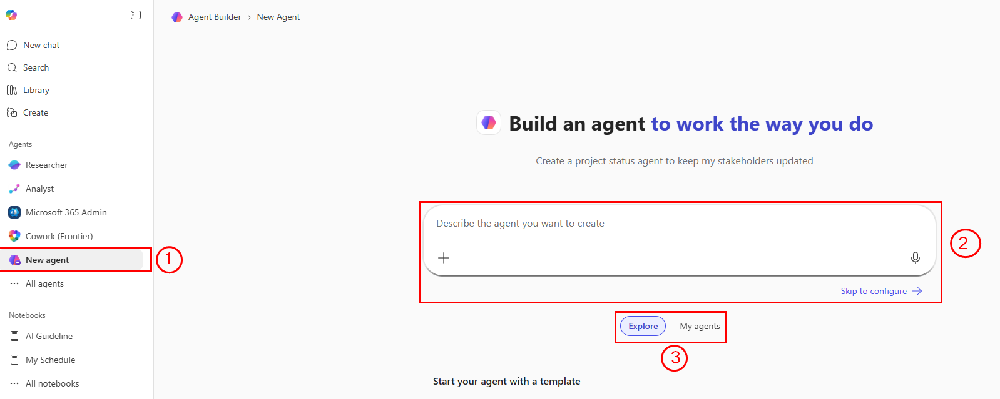
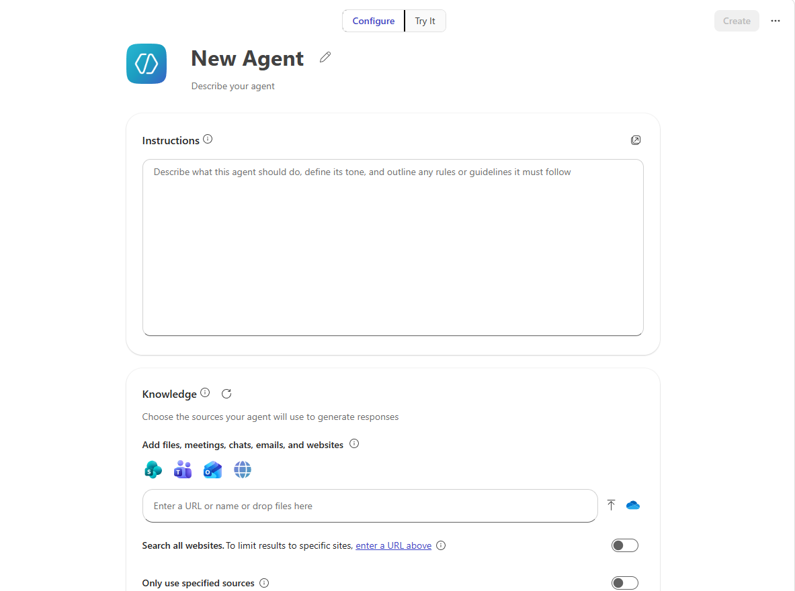

# 10 — Copilot Studio: Introduction to Agents

You have used Copilot as a tool that responds when you ask it something. An agent takes that further — it can act on your behalf, run on a schedule, and interact with other systems automatically. This topic is an introduction to what agents are and how to build a simple one.

> **Prompts to Try:** Open the [copy-paste prompt exercises](./prompts.md) for this topic.

> **Note:** This is an introductory overview. A full Copilot Studio workshop covers agents in much more depth. The goal here is to understand what agents are and build something simple to see how they work.

---

## Continuing from Topic 09

You have now researched, drafted, refined, sent, presented, surveyed, and analysed your AI Usage Guide. This final topic closes the loop by showing you how to automate the ongoing feedback process using a Copilot Studio agent.

Instead of manually sending a survey every week, an agent can ask your team one question, collect the response, and report back to you automatically.

---

## Agents You Have Already Seen: Researcher and Analyst

Before building your own, it is worth noting that you have already used agents in this workshop. In Topic 01 and Topic 03 you saw the **Researcher** and **Analyst** agents in Copilot Chat. Those are pre-built agents that Microsoft has configured with a specific purpose and set of capabilities.

- **Researcher** is grounded in web search and designed for deep research tasks
- **Analyst** is designed for data analysis and works with files and structured data

What you will build in Copilot Studio is the same concept, just configured by you for your own specific use case.

---

## Copilot Chat vs Copilot Agents

| | Copilot Chat | Copilot Agent |
|--|-------------|--------------|
| How it works | You ask, it responds | It can act on its own based on triggers |
| Who initiates | You every time | You set it up once, it runs |
| Best for | One-off tasks, research, drafting | Repeatable, structured, automated workflows |
| Can it take actions? | Limited | Yes: send emails, update records, post messages |
| Built in | Microsoft 365 Copilot Chat | Microsoft Copilot Studio |

---

## What is Copilot Studio?

Copilot Studio is a low-code platform from Microsoft where you can build custom AI agents. You do not need to write code. You use a visual designer to define what the agent does, when it does it, and how it responds.

Access it at: [copilotstudio.microsoft.com](https://copilotstudio.microsoft.com/)

---

## Two Ways to Get Agents

### 1. Agents from Copilot Chat
In Copilot Chat, click the **Agents** section in the left sidebar to find and use pre-built agents for common tasks like HR queries, IT helpdesk, and document search. You saw these in Topic 01.

### 2. Agents you build in Copilot Studio
You build these yourself using the Copilot Studio designer. You define the agent's name, what it knows, what it can do, and how it behaves.

---

## The Copilot Studio Interface



*Callout 1: the New Agent button to start building from scratch. Callout 2: the chat-based agent creator where you describe what you want the agent to do and Copilot Studio builds it for you. Callout 3: explore pre-built agents from Microsoft or view your own previously built agents.*

The fastest way to build a new agent is using Callout 2 — describe your agent in plain language and Copilot Studio generates the initial configuration for you. You can then refine it in the builder.

---

## Workshop Scenario: A Weekly Feedback Agent

After collecting your initial survey in Topic 08, you want a way to check in with your team every week without manually sending surveys each time. An agent can do this for you.

The agent you will build:
- Asks team members one question: "How has the AI guideline helped you this week?"
- Collects their response
- Thanks them and confirms the response was recorded

This is a simple conversational agent, but it shows the core concept behind everything Copilot Studio can do.

---

## How to Build the Agent

### Step 1: Open Copilot Studio
Go to [copilotstudio.microsoft.com](https://copilotstudio.microsoft.com/) and sign in with your Microsoft 365 account.

### Step 2: Create a new agent using the chat builder
Click the chat input (Callout 2 in the interface screenshot) and describe your agent:

```
Create a weekly check-in agent for our AI Usage Guideline. 
It should ask employees one question about how the AI 
guideline helped their work this week, collect their 
response, and thank them. Keep the conversation to 
3 exchanges maximum. Friendly and encouraging tone.
```

Copilot Studio will generate the initial agent configuration for you.

### Step 3: Review and refine the configuration



*The agent builder configuration screen where you can edit the agent's name, description, instructions, and knowledge sources. This is where you fine-tune what the agent knows and how it behaves.*

Review and adjust:
- **Name:** AI Guideline Weekly Check-in
- **Description:** A short summary of what the agent does
- **Instructions:** The full system prompt that defines the agent's behaviour
- **Knowledge:** Any documents you want the agent to reference (optional: add your AI Usage Guide PDF here)

### Step 4: Test the agent
Use the **Test your agent** panel on the right side of Copilot Studio. Type "weekly check-in" and see how the agent responds. Adjust the instructions if the response is not right.

### Step 5: Publish and share
Once you are satisfied, click **Publish**. You can then share the agent with your team via Teams or a direct link.

---

## Key Concepts

**Trigger:** What starts the agent conversation — a keyword, a scheduled time, or a button click.

**Topic:** A defined conversation flow — what the agent says and what it does based on user responses.

**Action:** Something the agent does beyond talking — like saving a response to SharePoint, sending an email, or updating a form.

**Knowledge:** Documents or websites you give the agent to reference when answering questions.

**Channel:** Where the agent is deployed — Microsoft Teams, a website, SharePoint, or a custom app.

---

## Where to Go from Here

This introduction covered the basics. A full Copilot Studio workshop would go into:

- Building multi-turn conversations with conditional logic
- Connecting agents to Power Automate for automated actions
- Grounding agents in your company's SharePoint knowledge base
- Publishing agents to Teams for your whole organisation
- Monitoring agent usage and improving performance over time

**Microsoft Learn resources:**
- [Get started with Copilot Studio](https://learn.microsoft.com/en-us/microsoft-copilot-studio/fundamentals-what-is-copilot-studio)
- [Build your first agent](https://learn.microsoft.com/en-us/microsoft-copilot-studio/quickstart-get-started)
- [Add knowledge to your agent](https://learn.microsoft.com/en-us/microsoft-copilot-studio/knowledge-add-existing-sources)

---

*You have completed the workshop. Well done.*

*Back to: [09 — Copilot in Excel](../09-copilot-excel/) | Return to: [Workshop Home](../)*
