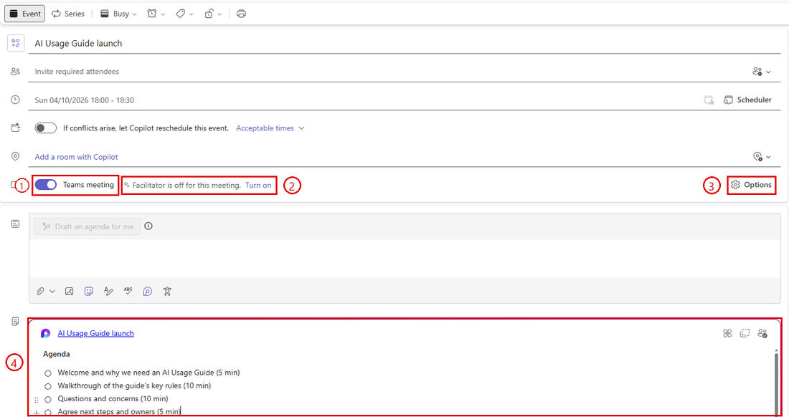
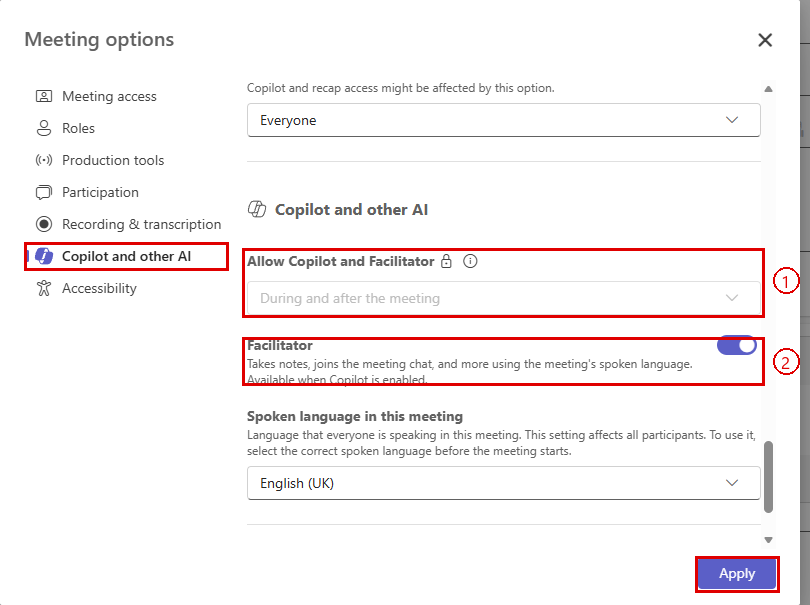
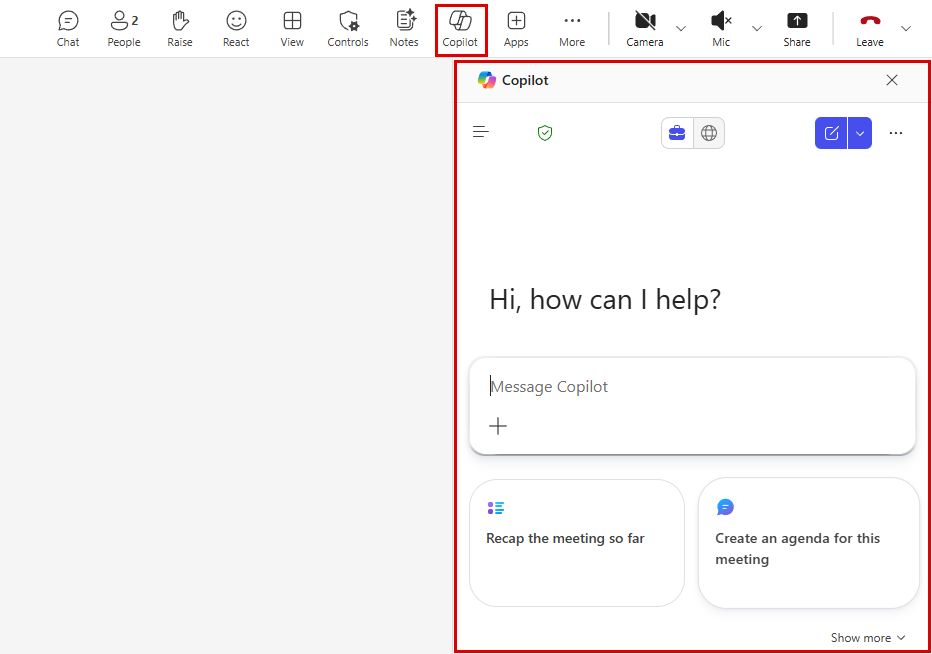
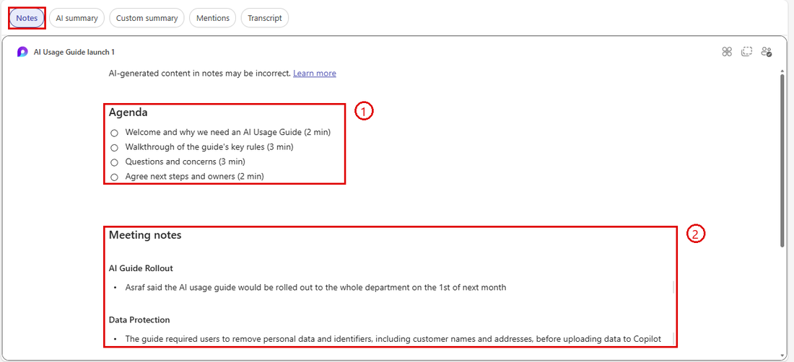
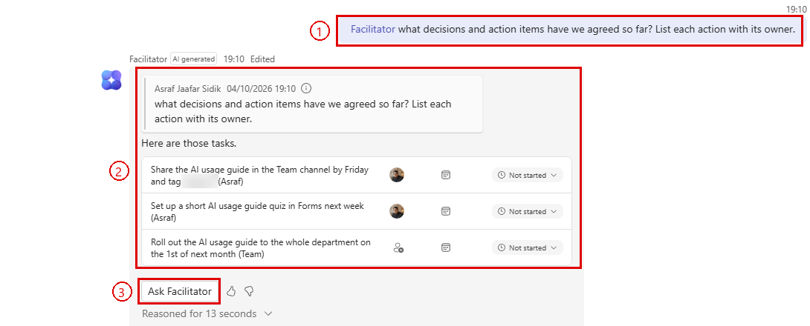
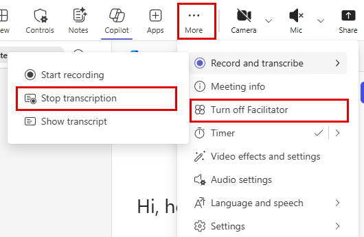
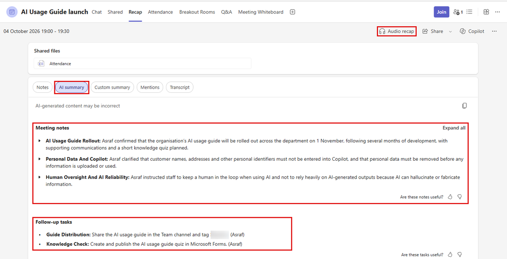
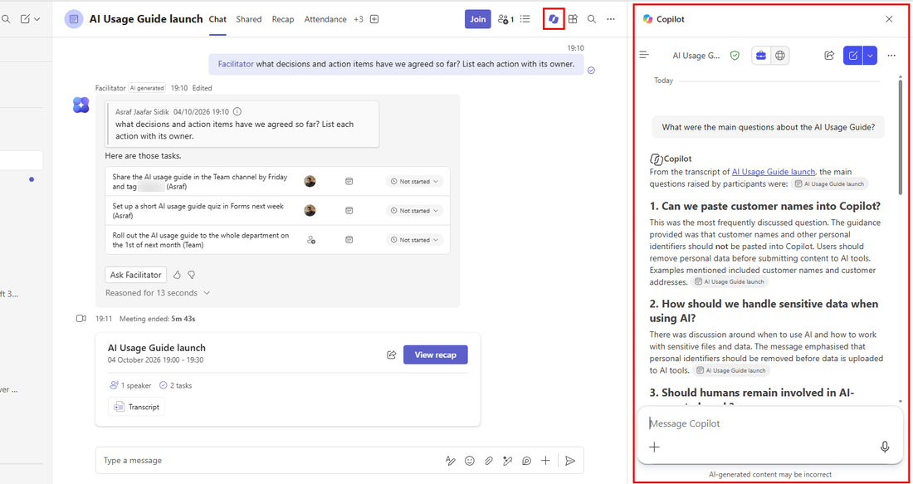

# 10 — Copilot in Teams

Your AI Usage Guide is approved and you have a deck to present it. The next step is the launch meeting: walk your team through the guide, answer their questions, agree what happens next, and make sure people who missed it can catch up. Copilot in Teams helps with all of that, before, during and after the meeting.

> **Prompts to Try:** Open the [copy-paste prompt exercises](./prompts.md) for this topic.

> **When to teach this topic:** it follows on naturally from Topic 07, since the launch meeting is where you present your deck. Run it straight after Topic 07 if you prefer, or here, before Copilot Studio.

---

## Continuing from Topic 07

At the end of Topic 07 you had a team briefing deck for the AI Usage Guide. In this topic you present it in a Teams meeting and let Copilot capture the discussion.

**If you have your deck:** share it in the meeting when you present.

**If you do not have it:** any three slides will do. The point of this topic is what Copilot does with the conversation, not the slides themselves.

**Working in a training room?** Pair up. One person schedules a 10-minute Teams meeting and invites the other, then you swap roles for the second half.

---

## What Copilot Can Do in Teams

- Summarise a meeting while it is still running, including who said what
- Answer questions about the meeting, such as "what did we decide?" or "what questions are still open?"
- Suggest action items and owners
- Run the meeting with **Facilitator**: track the agenda, take live notes, log decisions and list follow-ups
- Give you a **Recap** afterwards, including an audio recap you can listen to
- Summarise a long chat or channel conversation so you can catch up quickly

> **License note:** Copilot in meetings, Facilitator and the meeting recap need a Microsoft 365 Copilot (Premium) license. Your organisation's settings also decide whether they appear, so if you cannot see a button described here, check with your trainer or IT team.

---

## Before the Meeting: Set Up the Agenda and Facilitator

Facilitator works best when the meeting has an agenda. It looks for one in the meeting description and in the meeting's Loop notes.

1. In Teams, select **Calendar**, then **New** (top right).
2. Give it a title, for example *AI Usage Guide launch*, and invite your team (or your partner).
3. Turn on the **Teams meeting** toggle. A line appears next to it saying whether Facilitator is on, with a **Turn on** link, and an **Options** button appears on the right.
4. Scroll to the bottom of the invitation and select **Add an agenda** (if the meeting starts straight away, the link may say **Add meeting notes** instead; it adds the same Loop component). A Loop component appears with an **Agenda** list. Type your agenda items into it, one per line. Part 1 of the prompts shows how to get Copilot to write them for you (the **Draft an agenda for me** button above the description can also do this).

*Callout 1: the Teams meeting toggle. Callout 2: Facilitator status, with Turn on. Callout 3: Options. Callout 4: the Loop agenda added with Add an agenda.*

5. Select **Turn on** next to the Facilitator line, or open **Options**, choose **Copilot and other AI**, turn on **Facilitator** and select **Apply**.
6. Check how Copilot is allowed to run (see the table below), then select **Save** (or **Send** if you invited people).

*Callout 1: Allow Copilot and Facilitator. A padlock means your organisation has fixed this setting. Callout 2: the Facilitator toggle. When Facilitator is on, you can also set the spoken language of the meeting.*

### Choosing how Copilot runs

The **Allow Copilot and Facilitator** setting has these choices. If you see a padlock next to it, your organisation has set it for you and you cannot change it.

| Setting | What it means | Use it when |
|---------|--------------|-------------|
| **During and after the meeting** | Copilot uses the transcript, so you can keep asking it questions after the meeting ends | You want a record and follow-up questions (the usual choice) |
| **Only during the meeting** | Copilot works from live speech without saving a transcript. Nothing is left to ask about afterwards | The discussion is sensitive and you do not want a transcript kept |
| **Off** | No Copilot or Facilitator in this meeting | Copilot is not appropriate for this meeting |

---

## During the Meeting

1. Start the meeting and present your deck.
2. Select **Copilot** in the meeting controls. If transcription is not on yet, Copilot asks you to start it. (Some organisations start transcription automatically, and everyone sees a "Transcription has started" notice.)
3. Ask Copilot questions as the discussion goes on, or pick a suggestion such as **Recap the meeting so far**. Part 2 of the prompts has questions that work well.

*Select Copilot in the meeting controls to open the Copilot pane on the right.*

Only you see your Copilot questions and answers. Other people in the meeting cannot see what you ask.

### Facilitator in the meeting

If Facilitator is on, it joins the meeting as a participant and works for everyone, not just for you:

- It shows the agenda in a bar across the top of the meeting, with a timer for each item, and ticks items off as you cover them
- It takes notes in the shared Loop meeting notes as people talk (select **Notes** in the meeting controls to see them)
- It records decisions and follow-up tasks, with owners where it can tell who agreed to what

*Facilitator's notes for the AI Usage Guide launch, on the Notes tab of the Recap. Callout 1: the agenda (items are ticked off when the meeting moves through them). Callout 2: Facilitator's meeting notes, grouped by topic.*

### Ask Facilitator in the meeting chat

Facilitator also joins the meeting chat, so anyone in the meeting can ask it a question there. Type **@Facilitator**, pick **Facilitator** from the suggestions, then type your question, for example *what have we agreed so far?* Select **Ask Facilitator** under one of its replies to follow up. When you ask about action items, Facilitator replies with a list of trackable tasks, each with an owner and a status such as **Not started**.

*Callout 1: the @Facilitator question. Callout 2: Facilitator's reply, with each action as a task and its owner. Callout 3: Ask Facilitator, to follow up.*

The difference from Copilot is who sees the answer:

| | Copilot | Facilitator in the chat |
|---|---------|------------------------|
| **Who sees the question and answer** | Only you | Everyone in the meeting chat |
| **Best for** | Private questions, such as "what did I miss?" or "what should I ask next?" | Questions the whole group benefits from, such as "what are the action items so far?" |

> **Tip:** ask Facilitator to list the decisions and action items in the chat just before the meeting ends. Everyone sees the same list, so people can correct an owner or a date while they are still in the meeting.

### Turning the AI off mid-meeting

Organisers can stop the AI during a live meeting when the conversation moves to something that should not be summarised, such as a personal matter or a confidential deal:

- **More → Record and transcribe → Stop transcription** stops the transcript, so Copilot and the recap stop capturing what is said
- **More → Turn off Facilitator** removes Facilitator from the meeting

You can turn both back on from the same menu. Some organisations also show a single **Meeting AI** switch that does both.

*In the meeting controls, select More. Stop transcription is under Record and transcribe, and Turn off Facilitator is in the main menu.*

> **Key point:** everyone in the meeting is told when transcription starts. Copilot in a meeting follows the same rule as the Enterprise Data Protection you met in Topic 01: it is secure, but it is not private from your organisation.

---

## After the Meeting: Recap

When the meeting ends, open the meeting chat and select **Recap** at the top. You will find:

- **AI summary**: **Meeting notes** grouped by topic, with timestamps that jump to that point in the recording, and **Follow-up tasks** with suggested owners
- **Notes**: Facilitator's Loop notes, if Facilitator was on
- **Custom summary**, **Mentions** and **Transcript** tabs
- **Copilot** (top right): keep asking questions about the meeting (if Copilot ran during and after the meeting)
- **Audio recap** (and **Video recap** if the meeting was recorded): a short summary you can listen to or watch, useful for anyone who missed the meeting

*The Recap of the AI Usage Guide launch, with Audio recap, the AI summary tab, Meeting notes, and Follow-up tasks with their owners highlighted. This meeting was not recorded, so there is no Video recap.*

> **Good habit:** read the action items before you share them. Copilot is good at spotting who agreed to something, but it can attach an action to the wrong person if two people spoke at once.

---

## Copilot in Chats and Channels

Copilot also works in ordinary Teams chats and channels, not just meetings.

1. Open a chat or channel.
2. Select the **Copilot** icon (**Open Copilot**) at the top right of the conversation.
3. Pick a suggestion or ask it to summarise, for example *What were the main questions about the AI Usage Guide this week?*

*The Copilot icon at the top right of the meeting chat opens Copilot in a side pane, here answering "What were the main questions about the AI Usage Guide?" from the meeting transcript.*

By default Copilot looks at the last 30 days of the conversation. You can ask for a shorter or longer window, such as *the last 7 days*.

---

## Workshop Scenario

You run the launch meeting for your AI Usage Guide. Before the meeting you get Copilot to draft an agenda and turn Facilitator on. During the meeting you present your deck and use Copilot to keep track of questions and decisions. Afterwards you use the recap to send a follow-up to the team channel and catch up a colleague who could not attend.

---

## Tips for Copilot in Teams

- Turn transcription on early. Copilot can only answer questions about the part of the meeting it heard.
- Give the meeting a clear agenda. Facilitator and the recap are both much better when the meeting has structure.
- Ask Copilot "What questions have not been answered yet?" near the end of the meeting, while people are still there to answer them.
- Use **Only during the meeting** for sensitive discussions, so no transcript is kept.
- Copilot in a chat only reads that chat. To pull information from across your emails, files and meetings, use Copilot Chat with Work IQ on (Topic 03).
