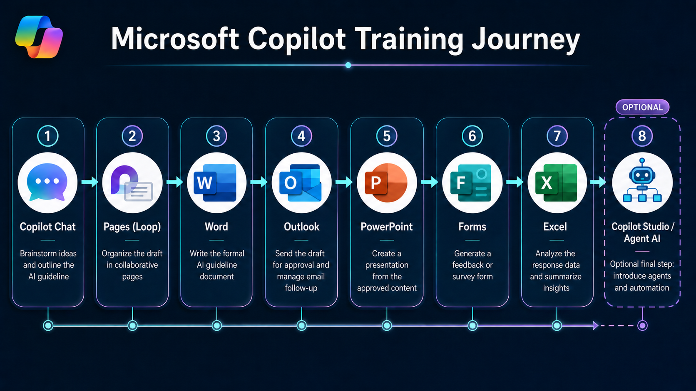

# Microsoft 365 Copilot Workshop

Prompts, reference notes, and sample datasets for the Microsoft 365 Copilot workshop.

---

## Program Flow

---

## How to Use This Site

Each topic has its own page with a README covering the concepts and a separate prompts file with copy-paste prompts you can use during and after the session.

**To copy a prompt:** open the prompts file, find the prompt you want, and click the copy icon on the top right of the code block.

**To download everything:** click the green **Code** button on the main repo page, then **Download ZIP**.

---

## Workshop Scenario

Throughout this workshop you will work on one connected project from start to finish:

> **You are creating an AI Usage Guide for your department.**

This guide will explain how your team should use AI tools responsibly and effectively. You will research it, draft it, refine it as a proposal, email it for approval, present it to your team, collect feedback, analyse the results, and finish with a hands-on intro to building your own Copilot agent.

---

## Topics

| # | Topic | What's Inside |
|---|-------|--------------|
| 01 | [Copilot Fundamentals](./01-copilot-fundamentals/) | What is Copilot, licensing tiers, AI terminology, memory, and personalisation |
| 02 | [Prompt Engineering](./02-prompt-engineering/) | The GCSE framework, weak vs strong prompts, iteration, and common mistakes |
| 03 | [Copilot Chat](./03-copilot-chat/) | Interface walkthrough, grounding, research prompts, and model comparison |
| 04 | [Copilot Pages](./04-copilot-pages/) | Drafting content, Mermaid diagrams, and the Loop connection |
| 05 | [Copilot in Word](./05-copilot-word/) | Turning your draft into a formal proposal |
| 06 | [Copilot in Outlook](./06-copilot-outlook/) | Submitting your proposal and managing email conversations |
| 07 | [Copilot in PowerPoint](./07-copilot-powerpoint/) | Building a presentation from your approved document |
| 08 | [Copilot in Forms](./08-copilot-forms/) | Creating a feedback survey for your team |
| 09 | [Copilot in Excel](./09-copilot-excel/) | Analysing survey responses with sample data included |
| 10 | [Copilot Studio Intro](./10-copilot-studio-intro/) | What agents are, how to build one, and where to go next |

---

## Sample Data

The file [AI_Guideline_Survey_Responses.xlsx](./09-copilot-excel/AI_Guideline_Survey_Responses.xlsx) in the Excel folder contains 30 pre-populated survey responses for use in Topic 09. You do not need to wait for real responses to complete the Excel exercises.

---

*Last updated: May 2026 | Trainer: Asraf*
